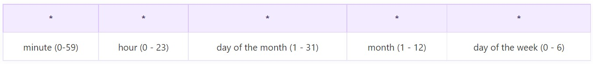

Cron strings are formatted in cron format(UNIX). This is a space-separated list of numbers for when the schedule will execute:

Each value may be a number, a fraction, or an asterisk `*` .

The cron expression is made of five fields. Each field can have the following values.

Here are some examples for you.

`* * * * *`     Every minute

`0 * * * *`     Every hour

`0 0 * * *`     Every day at 12:00 AM

`0 0 * * FRI`   At 12:00 AM, only on Friday

`0 0 1 * *`     At 12:00 AM, on day 1 of the month

Please refer to a full reference on cron formatting [here](https://www.ibm.com/docs/en/db2oc?topic=task-unix-cron-format)

Also, it is worth to see the [Cron expression generator](https://crontab.cronhub.io/)