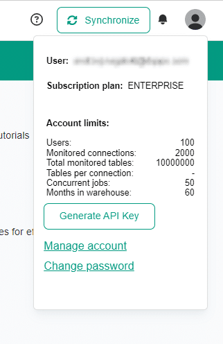
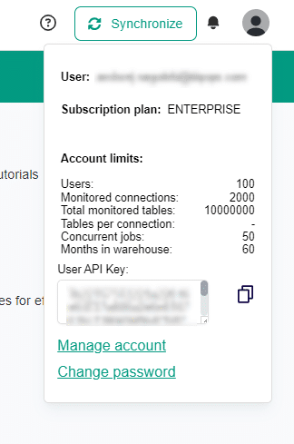

# REST API and Python client

A running DQOps instance can be interacted with through the use of a RESTful API.


## Overview

You can integrate the DQOps REST API with Python code using `dqops` package.

*Check out the [guide](#python-client-guide) underneath. It will walk you through several common use cases for the DQOps Python client.*


## Connecting to DQOps

For the purposes of this guide, we'll be using the synchronous interface offered by the authenticated Python client.
It waits for the response from the REST API before execution of the program will resume.

It is recommended to only allow authenticated users to access the service, especially for exposed REST APIs that can be accessed by different users.
For this purpose, the authenticated Python client for DQOps requires an API Key to be passed.
The client puts the API Key as a `Bearer` token in the `Authorization` header for each HTTP request sent with it.


## Getting the personal API Key

You can easily get your personal, user-unique API Key through the DQOps Web UI.

1. Open your DQOps instance's Web UI in your browser. *If you're trying to access a local DQOps instance, that would be [http://localhost:8888/home](http://localhost:8888/home).*
2. Click on your portrait in the top-right corner.
3. Click on the "Generate API Key" button.

{ loading=lazy } &nbsp;&nbsp;&nbsp;&nbsp; { loading=lazy }


You can copy the generated API Key and use it in your Python project.
When running the examples below, use your API Key in place of the placeholder `s4mp13_4u7h_70k3n`.

## Alternative connecting methods

A running DQOps instance is by default shipped alongside a REST API server.
Here's a list of proposed ways of accessing the DQOps REST API:

1. [**curl**](#curl) - Direct HTTP method calls.
2. [**Python sync client**](#python-sync-client) - Unauthenticated synchronous Python client.
3. [**Python auth sync client**](#python-auth-sync-client) - Authenticated synchronous Python client.
4. [**Python async client**](#python-async-client) - Unauthenticated asynchronous Python client.
5. [**Python auth async client**](#python-auth-async-client) - Authenticated asynchronous Python client.

*You can find examples on how to execute each DQOps REST API operation using each of these methods in the [operations' documentation](./operations/index.md).*


### **curl**
Using curl you can communicate with the REST API by sending HTTP requests. It's a simple but effective way of trying out REST API functionality.
It can also easily be used as a part of CI/CD pipelines, which lets you validate data on the fly.

```bash
curl http://localhost:8888/api/connections^
	-H "Accept: application/json"

```


### **Python sync client**
This connecting method uses the synchronous interface offered by the unauthorized Python client.
Unauthorized client sends plain requests without an `Authorization` header, therefore no API Key is required.
Methods of the synchronous interface wait until a response from the REST API is captured before execution of the program will resume.
REST APIs that are accessible from a larger network and/or are accessed by many users should require requests to be authorized. Trying to access them with an unauthorized will result in failure (`401 Unauthorized` error).

```python
from dqops import client
from dqops.client.api.connections import get_all_connections

dqops_client = client.Client(
    'http://localhost:8888/',
    raise_on_unexpected_status=True
)

call_result = get_all_connections.sync(
    client=dqops_client
)

```


### **Python async client**
This connecting method uses the asynchronous interface offered by the unauthorized Python client.

Unauthorized client sends plain requests without an `Authorization` header, therefore no API Key is required.

Methods of the asynchronous interface send a request to the REST API and immediately resume the execution of the program.
To collect results, you have to explicitly await for the result.

*Learn more on how to use Python's asyncio API [here](https://docs.python.org/3/library/asyncio-task.html).*

REST APIs that are accessible from a larger network and/or are accessed by many users should require requests to be authorized.
Trying to access them with an unauthorized will result in failure (`401 Unauthorized` error).

```python
from dqops import client
from dqops.client.api.connections import get_all_connections

dqops_client = client.Client(
    'http://localhost:8888/',
    raise_on_unexpected_status=True
)

call_result = await get_all_connections.asyncio(
    client=dqops_client
)

```


### **Python auth sync client**
This connecting method uses the synchronous interface offered by the authorized Python client.

Authorized client, along each request, sends an API Key as a `Bearer` token in the `Authorization` header.
If you haven't already, go [here](#getting-the-personal-api-key) to generate your API Key.

Methods of the synchronous interface wait until a response from the REST API is captured before execution of the program will resume.

```python
from dqops import client
from dqops.client.api.connections import get_all_connections

token = 's4mp13_4u7h_70k3n'

dqops_client = client.AuthenticatedClient(
    'http://localhost:8888/',
    token=token,
    raise_on_unexpected_status=True
)

call_result = get_all_connections.sync(
    client=dqops_client
)

```


### **Python auth async client**
This connecting method uses the asynchronous interface offered by the authorized Python client.

Authorized client, along each request, sends an API Key as a `Bearer` token in the `Authorization` header.
If you haven't already, go [here](#getting-the-personal-api-key) to generate your API Key.

Methods of the asynchronous interface send a request to the REST API and immediately resume the execution of the program.
To collect results, you have to explicitly await for the result.

*Learn more on how to use Python's asyncio API [here](https://docs.python.org/3/library/asyncio-task.html).*

```python
from dqops import client
from dqops.client.api.connections import get_all_connections

token = 's4mp13_4u7h_70k3n'

dqops_client = client.AuthenticatedClient(
    'http://localhost:8888/',
    token=token,
    raise_on_unexpected_status=True
)

call_result = await get_all_connections.asyncio(
    client=dqops_client
)

```


## Python client guide

This guide will showcase the capabilities of DQOps REST API client when integrated into your Python applications.
Using an authenticated synchronous client we'll execute some key operations. Find out about other methods of connecting to DQOps [here](#alternative-connection-methods).

Before heading on to the guide, you'll need to have completed the [DQOps installation using PIP](../dqops-installation/install-dqops-using-pip.md).
On top of that, connection to a DQOps instance with the authenticated client requires a valid [API Key](#getting-the-personal-api-key).


### **Run checks**

Starts a new background job that will run selected data quality checks

```python
from dqops import client
from dqops.client.api.jobs import run_checks
from dqops.client.models import CheckSearchFilters, \
                                RunChecksParameters

token = 's4mp13_4u7h_70k3n'

dqops_client = client.AuthenticatedClient(
    'http://localhost:8888/',
    token=token
)

request_body = RunChecksParameters(
	check_search_filters=CheckSearchFilters(
		column='sample_column',
		column_data_type='string',
		connection='sample_connection',
		full_table_name='sample_schema.sample_table',
		enabled=True
	),
	collect_error_samples=False,
	dummy_execution=False
)

call_result = run_checks.sync(
    client=dqops_client,
    json_body=request_body
)

```

By running this operation you should get a response that resembles the one below:

```python
RunChecksQueueJobResult(
	job_id=DqoQueueJobId(
		job_id=123456789,
		created_at='2007-10-11T13:42:00Z'
	),
	result=RunChecksResult(
		highest_severity=RuleSeverityLevel.ERROR,
		executed_checks=10,
		valid_results=7,
		warnings=1,
		errors=2,
		fatals=0,
		execution_errors=0
	),
	status=DqoJobStatus.FINISHED
)
```


### **Collect statistics on tables**

Starts a new background job that will run selected data statistics collectors for the entire table

```python
from dqops import client
from dqops.client.api.jobs import collect_statistics_on_table
from dqops.client.models import StatisticsCollectorSearchFilters

token = 's4mp13_4u7h_70k3n'

dqops_client = client.AuthenticatedClient(
    'http://localhost:8888/',
    token=token
)

request_body = StatisticsCollectorSearchFilters(
	column_names=[
		'sample_column'
	],
	collector_category='sample_category',
	connection='sample_connection',
	full_table_name='sample_schema.sample_table',
	enabled=True
)

call_result = collect_statistics_on_table.sync(
    client=dqops_client,
    json_body=request_body
)

```

By running this operation you should get a response that resembles the one below:

```python
CollectStatisticsQueueJobResult(
	job_id=DqoQueueJobId(
		job_id=123456789,
		created_at='2007-10-11T13:42:00Z'
	),
	result=CollectStatisticsResult(
		executed_statistics_collectors=3,
		columns_analyzed=1,
		columns_successfully_analyzed=0,
		total_collectors_failed=1,
		total_collected_results=2
	),
	status=DqoJobStatus.FINISHED
)
```


### **Collect statistics on data groups**

Starts a new background job that will run selected data statistics collectors on tables, calculating separate metric for each data grouping

```python
from dqops import client
from dqops.client.api.jobs import collect_statistics_on_data_groups
from dqops.client.models import StatisticsCollectorSearchFilters

token = 's4mp13_4u7h_70k3n'

dqops_client = client.AuthenticatedClient(
    'http://localhost:8888/',
    token=token
)

request_body = StatisticsCollectorSearchFilters(
	column_names=[
		'sample_column'
	],
	collector_category='sample_category',
	connection='sample_connection',
	full_table_name='sample_schema.sample_table',
	enabled=True
)

call_result = collect_statistics_on_data_groups.sync(
    client=dqops_client,
    json_body=request_body
)

```

By running this operation you should get a response that resembles the one below:

```python
CollectStatisticsQueueJobResult(
	job_id=DqoQueueJobId(
		job_id=123456789,
		created_at='2007-10-11T13:42:00Z'
	),
	result=CollectStatisticsResult(
		executed_statistics_collectors=3,
		columns_analyzed=1,
		columns_successfully_analyzed=0,
		total_collectors_failed=1,
		total_collected_results=2
	),
	status=DqoJobStatus.FINISHED
)
```


### **Import tables**

Starts a new background job that will import selected tables.

```python
from dqops import client
from dqops.client.api.jobs import import_tables
from dqops.client.models import ImportTablesQueueJobParameters

token = 's4mp13_4u7h_70k3n'

dqops_client = client.AuthenticatedClient(
    'http://localhost:8888/',
    token=token
)

request_body = ImportTablesQueueJobParameters(
	connection_name='sample_connection',
	schema_name='sample_schema',
	table_names=[
		'sample_table'
	]
)

call_result = import_tables.sync(
    client=dqops_client,
    json_body=request_body
)

```

By running this operation you should get a response that resembles the one below:

```python
ImportTablesQueueJobResult(
	job_id=DqoQueueJobId(
		job_id=123456789,
		created_at='2007-10-11T13:42:00Z'
	),
	result=ImportTablesResult(
		source_table_specs=[
			TableSpec(
				disabled=False,
				timestamp_columns=TimestampColumnsSpec(
					event_timestamp_column='col1',
					ingestion_timestamp_column='col2',
					partition_by_column='col3'
				),
				incremental_time_window=PartitionIncrementalTimeWindowSpec(
					daily_partitioning_recent_days=7,
					daily_partitioning_include_today=True,
					monthly_partitioning_include_current_month=False
				),
				groupings=DataGroupingConfigurationSpecMap(),
				table_comparisons=TableComparisonConfigurationSpecMap(),
				profiling_checks=TableProfilingCheckCategoriesSpec(
					volume=TableVolumeProfilingChecksSpec(
						profile_row_count=TableRowCountCheckSpec(
							parameters=TableVolumeRowCountSensorParametersSpec(),
							error=MinCountRule1ParametersSpec(min_count=1),
							disabled=False,
							exclude_from_kpi=False,
							include_in_sla=False
						)
					)
				),
				monitoring_checks=TableMonitoringCheckCategoriesSpec(),
				partitioned_checks=TablePartitionedCheckCategoriesSpec(),
				columns=ColumnSpecMap()
			)
		]
	),
	status=DqoJobStatus.FINISHED
)
```


### **Get table data quality status**

Read the most recent results of executed data quality checks on the table and return the current table&#x27;s data quality status - the number of failed data quality checks if the table has active data quality issues. Also returns the names of data quality checks that did not pass most recently. This operation verifies only the status of the most recently executed data quality checks. Previous data quality issues are not counted.

```python
from dqops import client
from dqops.client.api.check_results import get_table_data_quality_status
from dqops.client.models import CheckTimeScale

token = 's4mp13_4u7h_70k3n'

dqops_client = client.AuthenticatedClient(
    'http://localhost:8888/',
    token=token,
    raise_on_unexpected_status=True
)

call_result = get_table_data_quality_status.sync(
    'sample_connection',
    'sample_schema',
    'sample_table',
    client=dqops_client
)

```

By running this operation you should get a response that resembles the one below:

```python
TableCurrentDataQualityStatusModel(
	connection_name='sample_connection',
	schema_name='sample_schema',
	table_name='sample_table',
	current_severity=RuleSeverityLevel.WARNING,
	highest_historical_severity=RuleSeverityLevel.FATAL,
	last_check_executed_at='2007-10-14T16:42:42Z',
	executed_checks=8,
	valid_results=3,
	warnings=5,
	errors=0,
	fatals=0,
	execution_errors=0,
	data_quality_kpi=100.0,
	checks={
		'table_sample_check_1': CheckCurrentDataQualityStatusModel(
			current_severity=CheckResultStatus.WARNING,
			highest_historical_severity=RuleSeverityLevel.ERROR,
			last_executed_at='2007-10-14T14:13:42Z',
			check_type=CheckType.PROFILING,
			category='sample_category',
			quality_dimension='sample_quality_dimension',
			executed_checks=0,
			valid_results=0,
			warnings=1,
			errors=1,
			fatals=0,
			execution_errors=0
		),
		'table_sample_check_2': CheckCurrentDataQualityStatusModel(
			current_severity=CheckResultStatus.VALID,
			highest_historical_severity=RuleSeverityLevel.ERROR,
			last_executed_at='2007-10-14T14:39:42Z',
			check_type=CheckType.PROFILING,
			category='sample_category',
			quality_dimension='sample_quality_dimension',
			executed_checks=0,
			valid_results=0,
			warnings=1,
			errors=1,
			fatals=0,
			execution_errors=0
		)
	},
	columns={
		'sample_column_1': ColumnCurrentDataQualityStatusModel(
			current_severity=RuleSeverityLevel.WARNING,
			highest_historical_severity=RuleSeverityLevel.ERROR,
			last_check_executed_at='2007-10-14T16:42:42Z',
			executed_checks=3,
			valid_results=1,
			warnings=2,
			errors=0,
			fatals=0,
			execution_errors=0,
			checks={
				'sample_check_1': CheckCurrentDataQualityStatusModel(
					current_severity=CheckResultStatus.WARNING,
					highest_historical_severity=RuleSeverityLevel.ERROR,
					last_executed_at='2007-10-14T14:13:42Z',
					check_type=CheckType.PROFILING,
					category='sample_category',
					quality_dimension='sample_quality_dimension',
					executed_checks=0,
					valid_results=0,
					warnings=1,
					errors=1,
					fatals=0,
					execution_errors=0
				),
				'sample_check_2': CheckCurrentDataQualityStatusModel(
					current_severity=CheckResultStatus.VALID,
					highest_historical_severity=RuleSeverityLevel.ERROR,
					last_executed_at='2007-10-14T14:45:42Z',
					check_type=CheckType.PROFILING,
					category='sample_category',
					quality_dimension='sample_quality_dimension',
					executed_checks=0,
					valid_results=0,
					warnings=1,
					errors=1,
					fatals=0,
					execution_errors=0
				),
				'sample_check_3': CheckCurrentDataQualityStatusModel(
					current_severity=CheckResultStatus.WARNING,
					highest_historical_severity=RuleSeverityLevel.ERROR,
					last_executed_at='2007-10-14T16:42:42Z',
					check_type=CheckType.PROFILING,
					category='sample_category',
					quality_dimension='sample_quality_dimension',
					executed_checks=0,
					valid_results=0,
					warnings=1,
					errors=1,
					fatals=0,
					execution_errors=0
				)
			},
			dimensions={
			
			}
		),
		'sample_column_2': ColumnCurrentDataQualityStatusModel(
			current_severity=RuleSeverityLevel.WARNING,
			highest_historical_severity=RuleSeverityLevel.ERROR,
			last_check_executed_at='2007-10-14T16:42:42Z',
			executed_checks=3,
			valid_results=1,
			warnings=2,
			errors=0,
			fatals=0,
			execution_errors=0,
			checks={
				'sample_check_1': CheckCurrentDataQualityStatusModel(
					current_severity=CheckResultStatus.WARNING,
					highest_historical_severity=RuleSeverityLevel.ERROR,
					last_executed_at='2007-10-14T14:13:42Z',
					check_type=CheckType.PROFILING,
					category='sample_category',
					quality_dimension='sample_quality_dimension',
					executed_checks=0,
					valid_results=0,
					warnings=1,
					errors=1,
					fatals=0,
					execution_errors=0
				),
				'sample_check_2': CheckCurrentDataQualityStatusModel(
					current_severity=CheckResultStatus.VALID,
					highest_historical_severity=RuleSeverityLevel.ERROR,
					last_executed_at='2007-10-14T14:45:42Z',
					check_type=CheckType.PROFILING,
					category='sample_category',
					quality_dimension='sample_quality_dimension',
					executed_checks=0,
					valid_results=0,
					warnings=1,
					errors=1,
					fatals=0,
					execution_errors=0
				),
				'sample_check_3': CheckCurrentDataQualityStatusModel(
					current_severity=CheckResultStatus.WARNING,
					highest_historical_severity=RuleSeverityLevel.ERROR,
					last_executed_at='2007-10-14T16:42:42Z',
					check_type=CheckType.PROFILING,
					category='sample_category',
					quality_dimension='sample_quality_dimension',
					executed_checks=0,
					valid_results=0,
					warnings=1,
					errors=1,
					fatals=0,
					execution_errors=0
				)
			},
			dimensions={
			
			}
		)
	},
	dimensions={
	
	}
)
```


### **Wait for job**

Waits for a job to finish. Returns the status of a finished job or a current state of a job that is still running, but the wait timeout elapsed.

```python
from dqops import client
from dqops.client.api.jobs import wait_for_job

token = 's4mp13_4u7h_70k3n'

dqops_client = client.AuthenticatedClient(
    'http://localhost:8888/',
    token=token,
    raise_on_unexpected_status=True
)

call_result = wait_for_job.sync(
    '123123124324324',
    client=dqops_client
)

```

By running this operation you should get a response that resembles the one below:

```python
DqoJobHistoryEntryModel(
	status=DqoJobStatus.FINISHED,
	status_changed_at='2007-10-11T13:42:00Z'
)
```


## What's more

Are you looking to address a specific issue? Head down here for full reference documentation over DQOps REST API operations.

| Operation module | Description |
|------------------|-------------|
|[CheckResults](./operations/check_results.md)|Returns all the data quality check results of executed checks on tables and columns.|
|[CheckResultsOverview](./operations/check_results_overview.md)|Returns the overview of the recently executed checks on tables and columns, returning a summary of the last 5 runs.|
|[Checks](./operations/checks.md)|Data quality check definition management operations for adding/removing/changing custom data quality checks.|
|[Columns](./operations/columns.md)|Operations related to manage the metadata of columns, and managing the configuration of column-level data quality checks.|
|[Connections](./operations/connections.md)|Operations for adding/updating/deleting the configuration of data sources managed by DQOps.|
|[Dashboards](./operations/dashboards.md)|Operations for retrieving the list of data quality dashboards supported by DQOps and issuing short-term access keys to open a dashboard.|
|[DataGroupingConfigurations](./operations/data_grouping_configurations.md)|Operations for managing the configuration of data groupings on a table level in DQOps.|
|[DataSources](./operations/data_sources.md)|Rest API controller that operates on data sources that are not yet imported, testing connections or retrieving the metadata (schemas and tables).|
|[DefaultColumnCheckPatterns](./operations/default_column_check_patterns.md)|Operations for managing the configuration of the default column-level checks for columns matching a pattern.|
|[DefaultTableCheckPatterns](./operations/default_table_check_patterns.md)|Operations for managing the configuration of the default table-level checks for tables matching a pattern.|
|[Defaults](./operations/defaults.md)|Default settings management for configuring the default data quality checks that are configured for all imported tables and columns.|
|[Dictionaries](./operations/dictionaries.md)|Operations for managing data dictionary CSV files in DQOps. Data dictionaries can be used in *accepted_values* data quality checks.|
|[Environment](./operations/environment.md)|DQOps environment and configuration controller, provides access to the DQOps configuration, current user&#x27;s information and issue local API Keys for the calling user.|
|[ErrorSamples](./operations/error_samples.md)|Operations that return the error samples collected when data quality checks were executed on data sources from the check editor, and rules failed with an error.|
|[Errors](./operations/errors.md)|Operations that return the execution errors captured when data quality checks were executed on data sources, and sensors or rules failed with an error.|
|[Healthcheck](./operations/healthcheck.md)|Health check operations for checking if the DQOps service is up and operational. Used for monitoring by load balancers.|
|[Incidents](./operations/incidents.md)|Data quality incidents controller that supports reading and updating data quality incidents, such as changing the incident status or assigning an external ticket number.|
|[Jobs](./operations/jobs.md)|Jobs management controller that supports starting new jobs, such as running selected data quality checks. Provides access to the job queue for incremental monitoring.|
|[Labels](./operations/labels.md)|Operations that returns all labels that are assigned to data assets. Labels serve the purpose of a lazy business glossary.|
|[LogShipping](./operations/log_shipping.md)|Log shipping controller that accepts logs sent from a web application or external tools and aggregates them in the local DQOps instance logs.|
|[Rules](./operations/rules.md)|Operations for managing custom data quality rule definitions in DQOps. The custom rules are stored in the DQOps user home folder.|
|[Schemas](./operations/schemas.md)|Operations for listing imported schemas from monitored data sources. Also provides operations for activating and deactivating multiple checks at once.|
|[Search](./operations/search.md)|Search operations for finding data assets, such as tables.|
|[SensorReadouts](./operations/sensor_readouts.md)|Operations that are retrieving the data quality sensor readouts of executed checks on tables and columns.|
|[Sensors](./operations/sensors.md)|Operations for managing custom data quality sensor definitions in DQOps. The custom sensors are stored in the DQOps user home folder.|
|[SharedCredentials](./operations/shared_credentials.md)|Operations for managing shared credentials in DQOps. Credentials that are stored in the shared .credentials folder in the DQOps user&#x27;s home folder.|
|[TableComparisonResults](./operations/table_comparison_results.md)|Operations that returns the results of the most recent table comparison that was performed between the compared table and the reference table (the source of truth).|
|[TableComparisons](./operations/table_comparisons.md)|Operations for managing the configurations of table comparisons between tables on the same or different data sources|
|[Tables](./operations/tables.md)|Operations related to manage the metadata of imported tables, and managing the configuration of table-level data quality checks.|
|[Timezones](./operations/timezones.md)|Operations for returning time zone names and codes supported by DQOps.|
|[Users](./operations/users.md)|Operations for managing access for DQOps users in a multi-user installations. User management is supported in the TEAM and ENTERPRISE licences.|


