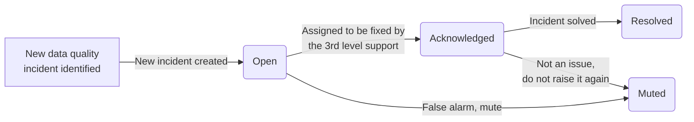
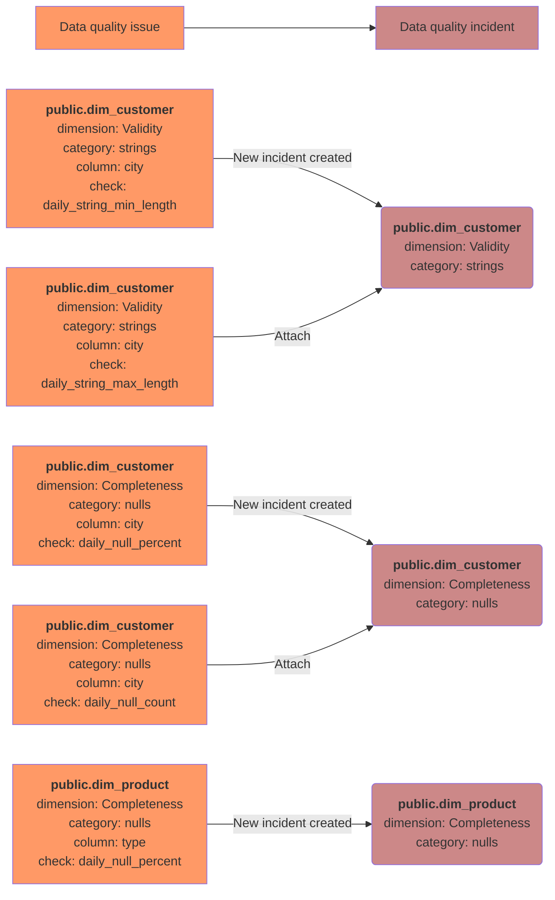

# Data quality incidents

## What is a data quality incident?

DQOps distinguishes **data quality issues** from **data quality incidents**. Because DQOps detects new data quality issues
by monitoring the data sources in regular intervals, the same issues will be detected until the root cause is not fixed.
Additionally, because DQOps supports hundreds of data quality checks, there are a lot of possible positive and false-positive
checks that can detect data quality issues.
Some data quality issues may be expected, because data quality checks have not been disabled on a table that was decommissioned.
Other issues are caused by planned maintenance events. 

In order to avoid flooding the support team with a lot of data quality issues to resolve, DQOps implements
grouping of similar data quality issues into **data quality incidents**. The difference between a data quality issue
and data quality incident is described below.

 -  A **data quality issue** is a single data quality [check](../checks/index.md) result that was not accepted by 
    a data quality [rule](../rules/rules.md), and was assigned a severity rule, which is one of *warning*, *error* or *fatal*.
    Data quality issues are stored in the [check_results](../../reference/parquetfiles/check_results.md) parquet table.
    The data quality issues can be counted on the data quality dashboards for [counting issues](../types-of-data-quality-dashboards.md#data-quality-issues-count).
    The percentage of data quality issues within the total number of data quality checks performed is also
    used to measure the overall quality of data by calculating the [data quality KPIs](../definition-of-data-quality-kpis.md).
 
 -  A **data quality incident** is a group of similar data quality issues that share the same properties. 
    When the first data quality issue is identified that does not match any active incident, a new data quality incident is created
    and the issue is associated with it. DQOps stores the incidents in the [incidents](../../reference/parquetfiles/incidents.md)
    parquet table.

    Data quality incidents are assigned to the support and engineering teams for assessment and resolution. 

## Incident workflow
The data quality incident management workflow is shown on the following diagram.

The following statuses are used in the data quality incident workflow.

- **Open** for a new incident that was just detected because a new data quality issue (failed data quality check)
  was identified, and it did not match any other open, acknowledged or muted incident. These issues should be
  managed by the 2nd level support team or the data quality team. The issues must be first reviewed and assessed.
- **Acknowledged** is the next status that is assigned by the 2nd level support when the data quality issue is confirmed
  and is assigned to the 3rd level support team to be resolved.
- **Resolved** is the status assigned by the 3rd level support team when the issue is solved. The data quality team
  may subscribe to notifications when the acknowledged issues are assigned
- **Muted** is the status assigned to false-positive issues, issues that have low impact, or issues that cannot be solved,
  and it was conditionally accepted. DQOps will keep detecting data quality issues matching this incident.
  New incidents will be assigned to the muted incident for the next 60 days. The incident mute time window is configurable
  on a table level.

## Grouping issues into incidents
The **data quality issue** grouping is configured on a connection level a shown on the *Incidents and Notifications* screen below.

The following grouping levels are supported:

- Table
- Table and data quality dimension
- **Table, data quality dimension and check category**
- Table, data quality dimension, check category and check type
- Table, data quality dimension, check category and check name

By default, DQOps groups issues by the table where the issue was identified, the [data quality dimension](../data-quality-dimensions.md),
and a data quality check category that mostly groups the check by the type of column or a way how the check is implemented.

It is also possible to raise data quality incidents only for **error** and **fatal** or only **fatal** severity issues.
The default configuration assigned to each data source will create a data quality incident for all data quality issues,
including **warning** severity issues. The warning severity issues include also many anomaly detection checks that are
sensitive and may raise unexpected issues that will engage the support team. An alternative method of managing **warning** severity
issues is to increase the *minimum severity level* for raising incidents to **error**, and use the
[current table status](../types-of-data-quality-dashboards.md#current-table-status) dashboards to review warnings.

DQOps performs mapping of groups of data quality issues to an incident by calculating a hash code of all the selected
issue grouping components. The incident hash code is stored in the `incident_hash` column
in the [check_results](../../reference/parquetfiles/check_results.md) parquet table. For every new data quality issue detected,
DQOps searches for an open data quality incident with the same incident hash code. When a matching incident is found
that is not yet in the **resolved** status, DQOps will increase the `last_seen` column value
in the [incidents](../../reference/parquetfiles/incidents.md) table. All data quality issues that were detected
between the `first_seen` and the `last_seen` timestamps are considered as assigned to the same incident.

The following diagram shows how different data quality issues were grouped into three data quality incidents,
using grouping by table, data quality dimension, and a check category.

## Incident duration
If a data quality incident is open for more than *60* days since the first matching data quality issue was detected,
DQOps will create yet another incident and the new data quality issues will be associated with the new incident. 
This time window is configurable on the connection configuration screen shown above.
A different time window for matching new issues to incidents is configured for **Muted** incidents that were confirmed,
but the support team decided that they will not be resolved.

## Incident management
The list of incidents is shown in the *Incidents* section of the [user interface](../user-interface-overview.md).
The incident review begins on the incident list screen shown below.

The incidents are grouped by the data source. The user can search for incidents by all the fields shown on the incident list screen,
including the affected table name, the parent schema of the table, and the columns used for incident grouping: data quality dimension,
check category, check type or check name.

The incidents can be linked to 3rd party incident management systems, such as Jira, Azure DevOps or ServiceNow. 
Linking incidents is a manual operation, when the button in the *Issue Link* column is clicked, the url to the task in 
the 3rd party system should be added and saved. Incident linking can be also automated by calling 
the [set_incident_issue_url](../../client/operations/incidents.md#set_incident_issue_url) operation from a Python
code or by calling the DQOps REST API directly.

When a single incident is clicked, DQOps shows the incident detail screen. The url to this screen can be copied
to the clipboard and send to another DQOps user, who can review the issue. Also, the link is shown
in the [Slack incident notifications](../../integrations/slack/configuring-slack-notifications.md).

The incident management screens are described on the 
[working with incidents and notifications](../../working-with-dqo/managing-data-quality-incidents-with-dqops.md) page.

## Incident notifications
DQOps supports automation of the incident workflows by using notifications.
Please read the description of integrating incidents with other systems using [webhooks](../../integrations/webhooks/index.md).

Incident notifications configured for [Slack](../../integrations/slack/configuring-slack-notifications.md) will
use formatted messages that are shown on the Slack channels as shown below.

## What's next

- Learn how to use the [incident management screens](../../working-with-dqo/managing-data-quality-incidents-with-dqops.md)
  in the *Working with DQOps* section.
- Learn how to configure [data quality incident notifications with Slack](../../integrations/slack/configuring-slack-notifications.md)
- Learn how a generic integration using [webhooks](../../integrations/webhooks/index.md) is used for incident notifications.

