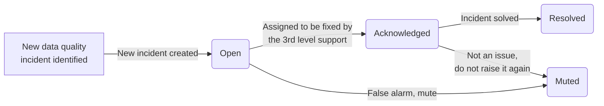

# Data quality KPIs

The purpose of data quality KPIs (Key Performance Indicators) is to measure data quality by calculating a reliable data quality score.
The score can be calculated for different data sources and across different [data quality dimensions](../data-quality-dimensions/data-quality-dimensions.md).

## Data quality score formula
DQOps calculates data quality KPIs as a percentage of passed [data quality checks](../checks/index.md) out of all executed checks.
The result of measuring the data quality KPI for two data quality checks, [daily_nulls_percent](../../checks/column/nulls/nulls-percent.md#daily-nulls-percent-)
and [daily_duplicate_percent](../../checks/column/uniqueness/duplicate-percent.md#daily-duplicate-percent-) on
5 columns over the period of 10 days is shown below.

Passed data quality checks are shown as green boxes. Data quality issues that decrease the data quality KPI
are shown as orange (*error* severity issue) and red (*fatal* severity issue) boxes.

DQOps supports also setting up a *warning* severity rule threshold. When only a *warning* severity rule
does not pass, DQOps creates a data quality issue for the warning, but warnings are counted as passed data quality checks,
not decreasing the overall data quality KPI.

The reason for excluding *warning* severity data quality issues is due to the nature of warnings.
They should be raised only for anomalies or data quality issues that are expected occasionally, and will be
reviewed when they are detected.

## Using KPIs for improving data quality

The data quality checks that are included in the data quality KPI are defined as [monitoring checks](../checks/./monitoring-checks/monitoring-checks.md)
and [partitioned checks](../checks//partition-checks/partition-checks.md).

## Calculating an initial data quality score

A new data source that is connected to DQOps should be profiled to calculate the initial data quality KPI.
The first step of profiling is capturing the [basic statistics](../../working-with-dqo/basic-data-statistics/basic-data-statistics.md)
such as the row count of tables, percent of null values in columns, and capturing sample values from columns.

After the basic statistics about the table and columns are captured, it is easy to identify columns that require further data quality analysis
using advanced data quality checks. 

The next step is configuring profiling checks to detect initial data quality issues. Sometimes, our expectation about the structure
and quality of the data source does not match reality. The data source documentation is outdated,
or the data quality checks are enabled only by reviewing a few sample values in each column. In that case, the data quality checks
that failed should be deactivated. Because DQOps [stores all data quality](../data-storage/data-storage.md) results after running
the checks, the results should be deleted using the [delete data quality results](../../working-with-dqo/delete-data-quality-results/delete-data-quality-results.md) screen.
If the orphaned results of failed data quality checks are not removed, they will decrease the data quality profiling KPIs,
because DQOps counts the percentage of passed checks as a quality score.

The data quality profiling scores are shown on the [data quality dashboards](../data-quality-dashboards/data-quality-dashboards.md).
The initial data quality KPI is shown on the **Profiling KPIs scorecard - summary** dashboard.

The data quality KPI is also calculated for each table, allowing the identification of the table that should be cleansed first.

## Storage of data quality check results

DQOps uses similar data quality check definitions for profiling checks, monitoring checks, and partition checks.
The difference between profiling, monitoring, and partition checks depends on how the data quality results are stored when the
data quality checks are reevaluated. 

DQOps stores only one result for each data quality check for each month. When profiling data quality checks are executed again during the same month,
the previous data quality results for the same month are replaced with new values.

Monitoring checks are designed to capture a daily or monthly snapshot of data quality results, analyzing the whole table every time.
When a daily monitoring data quality check is executed again during the same day, the previous result is replaced.
This approach allows fixing simple mistakes, such as using a wrong configuration of a data quality check, without affecting the data quality KPI score that is reported to the data stakeholders.

Daily monitoring checks have a strong impact on the data quality KPI, because all data quality KPI scorecard dashboards are designed
to measure the KPIs in monthly periods. Let's use an example of calculating a data quality KPI in April. 
April has 30 calendar days. A daily monitoring check will be evaluated 30 times between April 1st and April 30th.
If the data quality check fails for three days out of 30 days, that gives us a 10% failure rate. The data quality KPI score for this check
will be 90%, which is the percentage of days when the data quality check has passed.

The data quality KPI for partitioned checks is evaluated similarly to monitoring checks, except that the whole table is not analyzed every day.
Instead, DQOps runs queries with a **GROUP BY** *partition_by_column* clause, calculating different data quality results for each daily or monthly partition.
Partitioned checks in DQOps incrementally analyze the quality of tables

!!! note "Partitioned checks do not require physical table partitioning"

## Data quality issue severity

## Types of data quality KPIs

We can divide the data quality KPIs into business-focused and data engineering-focused. 

- The data quality KPIs for business help monitor data quality to create insights, optimize processes, and improve decision-making.
- The data quality KPIs for data engineering monitor the problems with the data pipelines, file skipping, pipeline failure, etc.

The data model used in DQOps for storing data quality test results supports reporting various data quality KPIs. DQOps 
stores the result for both passed (no alert raised or only a warning raised) and failed (errors or fatal alerts raised)
[data quality check](../checks/index.md) evaluations. 

[Data quality checks](../checks/index.md) can define the alerting threshold at three severity levels: warning, error and fatal.
The final alert raised by the data quality check evaluation reflects the most severe level for which the threshold has been met.

## Excluding checks from KPIs

## Aggregation of data quality KPIs
Data quality KPIs can be aggregated at multiple levels, providing ways to measure the data quality for time periods 
(days, weeks, months, etc.), data quality dimensions, data groupings (such as by country), or any combination of these 
grouping levels.

The expected result of calculating the data quality KPI at different grouping levels may look like the tables below.

Data quality KPIs at a day level.

| Date       | KPI value |
|:-----------|----------:|
| 2022-10-01 |     95.1% |
| 2022-10-02 |     96.2% |
| 2022-10-03 |     94.5% |
| 2022-10-04 |     94.7% |

Data quality KPIs at a day and data quality dimension level. 

| Date       | Timelines | Completeness | Validity |
|------------|-----------|--------------|----------|
| 2022-10-01 | 96.1%     | 97.4%        | 95.1%    |
| 2022-10-02 | 99.2%     | 94.6%        | 96.2%    |
| 2022-10-03 | 94.6%     | 97.0%        | 94.3%    |
| 2022-10-04 | 99.1%     | 93.2%        | 94.7%    |

## Data segmentation with data grouping

Additionally, data quality KPIs can be calculated for different [data groupings](../data-grouping/data-grouping.md)
separately. Data aggregated in a single database (or a data lake) can be loaded from different data sources. 
To calculate a separate data quality KPI for each data source, it must be possible to identify that source at the data level.

[Read more about data segmentation with data groupings](../data-grouping/data-grouping.md)

Data quality KPIs can also be calculated for combinations of data sources (data streams), time periods and data quality
dimensions. An example output of a data quality KPI calculation at a month, country-level data sources, and separate 
data quality dimensions would look like the following table:

|   Month | Data Source | Timelines | Completeness | Validity |
|--------:|:------------|----------:|-------------:|---------:|
| 2022-10 | US          |     96.1% |        97.4% |    95.1% |
| 2022-10 | UK          |     99.2% |        94.6% |    96.2% |
| 2022-10 | FR          |     94.6% |        97.0% |    94.3% |
| 2022-10 | JP          |     99.1% |        93.2% |    94.7% |

## Application of data quality KPIs
- vendors
- suppliers
- data contracts
- stages
- data streams
- financial data
- comparing data

## Measuring data quality for very big tables

## Improving data quality
month by month...

## Data quality KPIs dashboards

With DQOps, you can easily view calculated data quality KPIs using [dashboards](../data-quality-dashboards/data-quality-dashboards.md). 
Each type of checks (profiling, monitoring and partition) has a group of dedicated dashboards. To view dashboards, simply
go to the **Data Quality Dashboard** section

For example, to review the summary KPIs of all executed monitoring checks you can use the **KPIs scorecard - summary** dashboard.
You can find it in the **Monitoring** group, **Data quality KPIs** subgroup.

**KPIs per table and day** is another representative of KPIs dashboards. It allows reviewing data quality KPIs per table
and day of the month.

This dashboard allows filtering data by:

* current and previous month,
* connection,
* schema,
* data group,
* data quality dimension,
* check category,
* check name,
* column
* table,
* day of the month.

## What's next
- Look at some built-in [data quality KPI dashboards](../data-quality-dashboards/data-quality-dashboards.md#data-quality-kpis) 
- Read about [build-in data quality dashboards](../data-quality-dashboards/data-quality-dashboards.md)
- Learn how to [review results of data quality monitoring results on dashboards](../../working-with-dqo/data-quality-dashboards/data-quality-dashboards.md)
