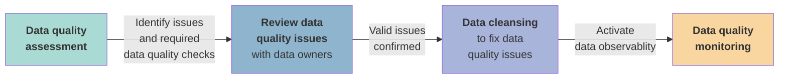
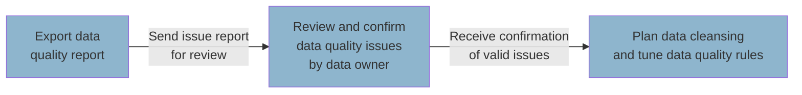
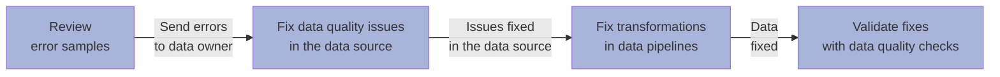
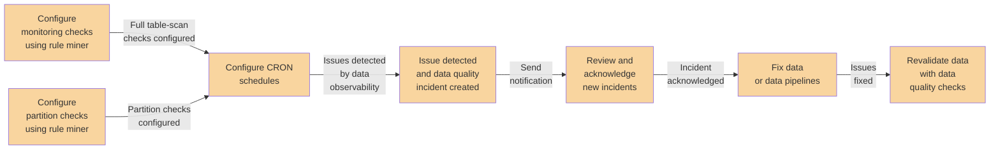

# What is Data Quality Process? Definition, Examples and Best Practices
Read this guide to learn an end-to-end data quality process, from data profiling and data quality assessment, to data observability and incident management.

## Data quality process overview
Ensuring data quality requires a process that has two main stages. 
The first stage is the data quality assessment, which focuses on understanding the dataset's structure and finding data quality issues.
It is followed by an optional data cleansing step to fix identified issues.

The second stage focuses on data quality monitoring to detect data quality issues in the future.
This stage, also called data observability, depends on running data quality checks and anomaly detection triggered by a scheduler.

### Problem
The purpose of data quality is to find data quality issues that make the datasets unusable for their purpose, 
such as deriving insights on dashboards or using them as training data in an AI project.

### Goal
Data teams that want to ensure data quality in their data platforms have three goals to achieve.

* Measure the health (data quality status) of each table.

* Fix the most severe data quality issues, ensuring that critical data assets are usable for their purpose.

* Detect new data quality issues automatically in the future.

### Solution
Achieving these goals requires a data quality platform that supports data observability to detect future issues.

* The data quality platform should help users perform data quality assessments and measure each table's baseline data quality status.

* The platform should help the data teams find and fix invalid records.

* Data observability is applied to detect anomalies and revalidate data quality checks at regular intervals, such as daily.

## Data quality lifecycle

The data quality lifecycle is a holistic process of ensuring data quality. 
Its purpose is to allow data teams to ensure data quality in a repeatable way and preserve high data quality in a long-term perspective.

It covers all steps, from learning about the structure of a table, selecting and evaluating data quality checks, reviewing detected data quality issues,
fixing these issues by data cleansing, and enabling long-term data quality monitoring to detect when the issue reappears instantly.

The data quality lifecycle stages are described in the following sections, which also show how DQOps supports this process.

### Data quality assessment

``` mermaid
graph LR
  BASIC_PROFILING[Basic statistics<br/>collection]:::step --> |Propose data<br/>quality checks| RULE_MINING[Data quality<br/>rule mining]:::step;
  RULE_MINING --> |Run proposed<br/>checks| ASSESSMENT_RESULTS_REVIEW[Review initial<br/>data quality KPI]:::step;
  ASSESSMENT_RESULTS_REVIEW --> |Correct data<br/>quality rules| DISABLE_FALSE_CHECKS[Disable false-positive<br/>checks and tweak rules]:::step;
  DISABLE_FALSE_CHECKS --> |Share data quality<br/>status report| CONSULT_DQ_ISSUES[Review data quality<br/>issues with the data owner]:::step;
  
  classDef step fill:#A9DBD4;
```

The purpose of performing a data quality assessment of a table is to understand its structure and data distribution
and find data quality issues. Data teams that will be using a dataset to ingest it into their data platform or data consumers,
such as data analysts or data scientists, can perform the data quality assessment to verify if the dataset is usable
for their use cases and how much data cleansing and transformation is required to make the data usable.

Data quality assessment is a routine activity for data governance and quality teams.
DQOps makes this process simpler and possible from a local computer without setting up any complex data quality platforms.
The data quality assessment of tables is performed in the data profiling module in DQOps.

!!! tip "DQOps data quality rule mining is a must-have tool for every software company dealing with data and AI projects"

    If you are starting an AI or Data & Analytics project for a customer, and the data quality is a concern, it should be measured in the project's first stage.
    As soon as you have access to the customer's database or data lake, you should start DQOps locally on your laptop in a new empty folder, 
    import the metadata of the tables, and let the rule mining engine find the most prominent data quality issues of all the tables that you will be using in the project.

    If you see any data quality issue that can pose a severe risk to the delivery of an AI or analytics project,
    use the table quality status screen to show the customer the data health status and request an additional budget
    for performing data cleansing before the poor data quality will affect the project's delivery timeline and goals.

DQOps simplifies the data quality assessment process by combining two DQOps features. 
The first step of data quality assessment is basic data profiling.
DQOps collects statistical information on each column and collects sample values from an analyzed table.

The [basic data statistics](../working-with-dqo/collecting-basic-data-statistics.md) screen showing selected statistics is shown below.

{ loading=lazy; width="1200px" }

The next step of data quality assessment is validating the data with data quality checks to ensure that
it meets its data quality requirements and is not affected by data quality issues.
Without a capable data quality platform, data professionals must run tens or hundreds of manually
written SQL queries to verify all aspects of data that could be potential data quality issues, such as too many null values.

DQOps users, such as data engineers, data stewards, or data quality teams, 
can speed up this process by using the DQOps rule mining engine to propose the configuration of data quality checks
to detect the most common data quality issues. DQOps uses statistics and data samples to propose these checks and their rule thresholds (parameters).

The following screenshot shows the rule mining proposals of data quality checks that should detect issues if less than 2% of records are invalid.

{ loading=lazy; width="1200px" }

### Review data quality issues

After performing the data quality assessment, the user will identify data quality issues that should be fixed. The data quality issues will fall into two categories:

* **Invalid data in the data sources**, which requires the engagement of the data source's owner to fix.
  For example, the data must be fixed in a line-of-business application (i.e., CRM, ERP).

* **Data transformation issues** that can be corrected in the data pipeline.

The tasks for fixing confirmed data quality issues should be planned for the data cleansing tasks.
False-positive issues will require disabling incorrectly configured data quality checks.

DQOps displays the [**Table quality status**](dqops-user-interface-overview.md#table-quality-status) for each table in the form of a matrix.
Each row represents the data quality health status for one table's row. 
The columns in this view group checks into [categories of data quality checks](../categories-of-data-quality-checks/index.md),
but an alternative view to show [data quality dimensions](data-quality-dimensions.md) is also supported.

The data quality checks are configured to raise data quality issues at various [severity levels](definition-of-data-quality-checks/index.md#issue-severity-levels). 
Warnings for minor problems, errors for problems that require fixing within a reasonable time, 
and fatal errors that require stopping data pipelines and applying data cleansing immediately.
The colors of cells in the matrix show the severity status of the most severe data quality issue for each column and category of checks.

{ loading=lazy; width="1200px" }

DQOps also supports editing the configuration of data quality checks
and reviewing the most recent data quality check status on the [data quality check editor](dqops-user-interface-overview.md#check-editor) screen shown below.

{ loading=lazy; width="1200px" }

### Data cleansing

The responsibility of fixing data cleansing tasks lies with the business platform owners, who are equipped to address issues in line-of-business applications.
The issues that can be fixed in the data pipelines should be fixed by updating the data transformation logic in the data pipelines. Data engineering teams perform this activity.

After the data is fixed, the data profiling checks previously configured in DQOps should be rerun to confirm that the data quality issues were fixed.

DQOps assists in data cleansing by [capturing data quality error samples](data-quality-error-sampling.md) from a subset of invalid records.
The following screen shows how DQOps detected column values that were not in the list of accepted categorical values.

{ loading=lazy; width="1200px" }

### Data quality monitoring

As soon as a valid set of data profiling checks is selected and false-positive data quality checks are disabled, 
the user is ready to activate continuous data quality monitoring.

DQOps supports two types of continuous data quality monitoring checks:

* [**Monitoring checks**](definition-of-data-quality-checks/data-observability-monitoring-checks.md) perform full-table scans in daily or monthly periods.
* [**Partition checks**](definition-of-data-quality-checks/partition-checks.md) evaluate the quality of each daily or monthly partition for append-only or huge tables.

These two types of checks are configured in the *Monitoring* and *Partition* sections of the [DQOps user interface](dqops-user-interface-overview.md).
DQOps will evaluate the configured data quality checks and raise [data quality incidents](grouping-data-quality-issues-to-incidents.md#incident-management) when data quality issues are detected.
Data operations or support teams will be notified by email or by [incident notifications](grouping-data-quality-issues-to-incidents.md#incident-notifications).

DQOps captures data quality measures and data quality results for each day, 
allowing regulatory compliance and measuring the reliability score ([data quality KPI](definition-of-data-quality-kpis.md)) for each table.

The following screen shows a data quality check editor screen for a table monitoring check that validates 
the [minimum row count](../categories-of-data-quality-checks/how-to-detect-data-volume-issues-and-changes.md#minimum-row-count). 
The "check results" tab lists historical data quality results, showing the minimum accepted row count 
(*440281* records proposed by the rule mining engine) and the actual row count observed for each day.

{ loading=lazy; width="1200px" }

DQOps measures the health of each table by calculating a data quality KPI score for each table, column, and data quality dimension. 
The [data quality KPI formula](definition-of-data-quality-kpis.md#data-quality-score-formula) used by DQOps
is derived as the percentage of successful data quality checks out of all executed data quality checks during the current reporting period, which is the current month.

The data quality KPI below 100% is information for the data consumer that says the table is currently 
affected by data quality issues or was recently affected by issues 
The user should not fully trust that the dataset will be healthy tomorrow.

The color of each cell identifies the highest [severity level](definition-of-data-quality-checks/index.md#issue-severity-levels)
(warning, error, fatal error) for an active data quality issue detected during the most recent data quality check evaluation.

{ loading=lazy; width="1200px" }

The DQOps data quality process has two stages. In the first stage, users perform the data quality assessment using data 
quality checks available in the **Profiling** section of the application. After running profiling checks on a table, 
the user should review its data quality status.
The false-positive data quality checks should be disabled, or their data quality rule thresholds should be tweaked to match requirements and the actual data distribution.

Once the user configures all [profiling checks](definition-of-data-quality-checks/data-profiling-checks.md),
DQOps requires a second stage to copy **approved** data quality checks from the profiling section to the **Monitoring checks** or **Partition checks** sections.
The [rule mining engine](data-quality-rule-mining.md) assists this process by copying profiling checks and their parameters.

The data observability engine will run the checks copied to the monitoring or partition check sections, 
and the data quality results will be checkpointed in the local [data quality data lake](architecture/dqops-architecture.md#data-quality-data-lake).
DQOps stores the [results of all data quality checks](data-storage-of-data-quality-results.md)
locally in Parquet files structured to be compatible with any data lake.

{ loading=lazy; width="1200px" }

An alternative method of configuring data quality checks is using [data quality policies](data-observability.md) managed by the data observability engine.
The policies are named configurations of data quality checks that are activated on every table or column that matches a filter.
For example, the filter can target all columns named as `*_id` in tables named `fact_*`. 
The data quality policy configuration will activate not null checks for all these tables without using the rule engine or the data quality check editor.

An example of a data quality check named "*Abnormal change in row count since the last known value*"
shown on one of the previous screenshots of the check editor shows such a check.
Its on/off switch control uses a light green color instead of dark green for checks configured manually or using the [rule engine](data-quality-rule-mining.md).

## Data quality incident management
The final step in ensuring a good data quality level is setting up the operational processes within the data team. 
DQOps will run monitoring and partition data quality checks using its [built-in CRON scheduler](../working-with-dqo/configure-scheduling-of-data-quality-checks/index.md). 
However, [triggering data quality checks from data pipelines](../integrations/airflow/index.md)
using the [DQOps client library](../client/index.md) is also supported.

DQOps groups similar data quality issues into [data quality incidents](grouping-data-quality-issues-to-incidents.md)
to avoid [sending notifications to data teams](grouping-data-quality-issues-to-incidents.md#incident-notifications) too often.
The data quality incidents group similar issues for each table, and all similar data quality issues detected until the incident is resolved are attached to an open incident.

The following screenshot shows the incident management screen, showing a list of recent data quality incidents.

{ loading=lazy; width="1200px" }

The details of the incident are shown after clicking a single incident. DQOps supports performing various actions on the incident, such as:

* [Acknowledging the incident](grouping-data-quality-issues-to-incidents.md#incident-workflow) activates a workflow to notify a data engineering team that they should fix it.

* The user can also [disable data quality checks](grouping-data-quality-issues-to-incidents.md#disable-check-for-the-incident) if it was generated by misconfigured checks.

* DQOps also supports tweaking the data quality rule thresholds to
  [decrease the frequency of similar incidents](grouping-data-quality-issues-to-incidents.md#reconfigure-check-for-the-incident) being raised. 
  It is primarily essential for decreasing the sensitivity of [anomaly detection](../categories-of-data-quality-checks/how-to-detect-anomaly-data-quality-issues.md).

{ loading=lazy; width="1200px" }

Users can also [configure incident notifications](grouping-data-quality-issues-to-incidents.md#incident-notifications)
and route them to the correct data teams based on filters, such as the connection or table name.

## What's next

- Learn how to import [metadata from a data source](configuring-data-sources.md) into DQOps
- Learn how to import [configure data quality checks](configuring-data-quality-checks-and-rules.md) into DQOps
- Understand the [concept of DQOps user interface](dqops-user-interface-overview.md)
- Learn how to use the DQOps [data quality rule miner](data-quality-rule-mining.md) to automate the data quality process
