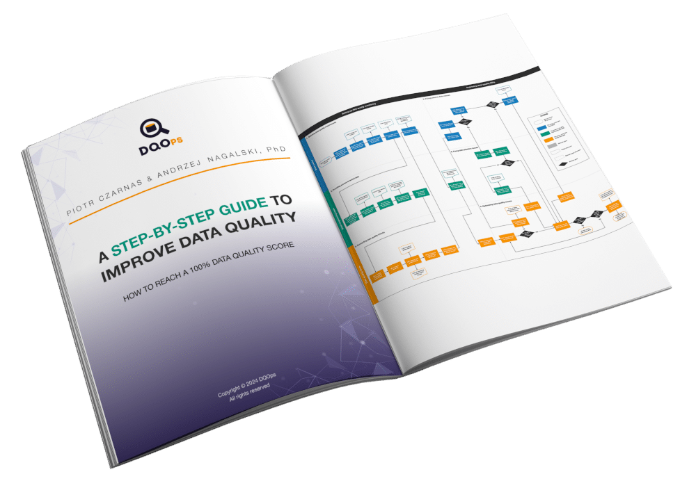
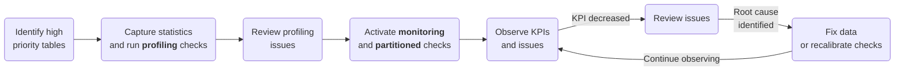

# How to measure data quality KPI - definition and formula
Learn how to measure the data quality KPI score with DQOps, what is the formula used to calculate the score, and how to improve data quality following KPIs.

## Purpose of data quality KPIs

The purpose of data quality KPIs (Key Performance Indicators) is to measure data quality by calculating a reliable data quality score.
The score will be used to assess the health and quality of data sources. It can be also used to verify compliance with
data quality requirements agreed in a data contract between a data producer and a data consumer.

We can divide the data quality KPIs into business-focused and data engineering-focused.

- The data quality KPIs for business help monitor data quality to proof the trustworthiness of data.
- The data quality KPIs for data engineering monitor the problems with the data pipelines, allowing the data engineering teams to
  improve the data platform.

The data quality score should be also calculated at a physical level, measuring the KPI of each

- data source
- database schema
- table
- column

Beyond monitoring physical entities such as tables, the data quality KPI should be also calculated at logical levels

- data domain in a data mesh architecture
- data producer
- external vendor that is providing data as part of their service contract
- data contract

DQOps calculates the data quality KPI score as a value between 0% and 100%, which is the percentage of passed data quality checks.
A percentage KPI is the easiest way to share between
all stakeholders, including the data teams, data stewards, data owners, data producers, and data consumers.

Beside calculating the data quality KPI for each physical and logical groups of data, the KPI must also support identifying the type
of data quality issue. For that purpose, all data quality check results are attributed with the name
of a [data quality dimension](data-quality-dimensions.md), allowing to identify the type of problem.


## Data quality score formula
DQOps calculates data quality KPIs as a percentage of passed [data quality checks](definition-of-data-quality-checks/index.md) out of all executed checks.
The data quality KPI is represented as a percentage value. The following formula calculates the score.

{ loading=lazy }

The result of measuring the data quality KPI for two data quality checks, [daily_nulls_percent](../checks/column/nulls/nulls-percent.md#daily-nulls-percent)
and [daily_duplicate_percent](../checks/column/uniqueness/duplicate-percent.md#daily-duplicate-percent) on
5 columns over the period of 10 days is shown below.

{ loading=lazy }

Passed data quality checks are shown as green boxes. Data quality issues that decrease the data quality KPI
are shown as orange (*error* severity issue) and red (*fatal* severity issue) boxes.

### **Issue severity levels**
DQOps supports configuring [data quality rules](definition-of-data-quality-rules.md) at three severity levels:

- *warning* severity issues are dedicated for anomalies and less severe data quality issues that the data producer
  (the data owner) should not be accountable because those type of issues are expected.
  The *warning* severity issues are calculated as passed data quality checks, not decreasing the data quality KPI.

- *error* severity issues are dedicated for data quality issues that should be resolved over time.
  They are counted as failed data quality checks in the data quality KPI, decreasing the final score.

- *fatal* severity issues are dedicated for very severe data quality issues that should even be detected inside
  the data pipelines. When a fatal issue is detected, the data pipeline should be stopped to prevent from
  spreading the data quality issues into the down stream tables. Similar to *error* severity issues, *fatal* severity
  issues are also counted as failed data quality checks, decreasing the data quality KPI.
  
The effect of *warning* severity issues on the data quality KPI formula used in DQOps is shown below. 

{ loading=lazy }

The reason for treating *warning* severity data quality issues as passed data quality checks is due to the nature of warnings.
Warnings should be raised only for anomalies or data quality issues that are expected occasionally, and will be
reviewed when they are detected. Warnings should be also raised for data quality issues that are outside the agreed
data contact between the data producer and the data consumer.

The updated data quality KPI formula is shown below.
The number of valid data quality results plus the number of warnings is divided by the total number of data quality results,
including both passed data quality checks and errors.

{ loading=lazy }


### **Excluding data checks from KPI**
The data quality issues can be divided into two groups

- Data quality issues that the **data producer** should be accountable for, they should be included in the KPI score

- Random data quality issues that are occasionally expected, or the data producer is not able to fix them because the data
  is received from an external source. For example, the data engineering team that has set up the data pipeline to load
  data received from a CRM platform is responsible for loading the data correctly, but cannot be make accountable for missing
  data (completeness issues), when the data was not entered by the sales team.

Data quality checks are excluded from KPI calculation in the check's settings section in DQOps as shown below.

{ loading=lazy; width="1200px" }

The configuration is stored in the *exclude_from_kpi* field in the YAML file, as shown below.

``` { .yaml .annotate linenums="1" hl_lines="11" }
# yaml-language-server: $schema=https://cloud.dqops.com/dqo-yaml-schema/TableYaml-schema.json
apiVersion: dqo/v1
kind: table
spec:
  monitoring_checks:
    daily:
      volume:
        daily_row_count:
          error:
            min_count: 1
          exclude_from_kpi: true # (1)!
```

1.  To exclude the check from the KPI score, set the value to *true*. The default value of this field is *false*.


## Improving data quality with KPIs

### **Sharing KPIs with stakeholders**
Measuring and increasing the data quality KPIs is the most reliable way to run a data cleansing project.
The biggest challenge that each data team faces when introducing data quality practices is gaining the support from the upper management.
The management expects to see the progress and a proof of success. Sharing the data quality KPI with the upper management
is the best way to gain secure financing for data projects.

!!! tip "Reaching 100% data quality KPI score"

    { width="300"; align=left }

    DQOps team has written an eBook ["A step-by-step guide to improve data quality"](https://dqops.com/best-practices-for-effective-data-quality-improvement/)
    that describes their experience in data cleansing and data quality monitoring using DQOps. 

    The eBook desribes a full data quality improvement process that allows to reach ~100% data quality KPI score within 6-12 months.

    The process described below is a simplified version of the full process described in the eBook.


### **Data quality improvement process**
An agile data cleansing project that is driven by data quality KPIs is shown below.



The main steps are described in the following sections.

### **Prioritize tables**
A successful data quality improvement process requires showing visible progress to data stakeholders, cleansing the most important
tables within the first weeks of the project.

DQOps uses numeric priorities (1, 2, 3, ...) configured on the table's metadata screen in the *Data Sources* section as shown below.

{ loading=lazy }


### **Profile tables**
Profile the data sources by calculating [basic statistics](../working-with-dqo/collecting-basic-data-statistics.md)
and running [profiling checks](definition-of-data-quality-checks/data-profiling-checks.md). Profiling checks in DQOps are designed
to be run once a month to capture the initial data quality KPI score. During the data profiling stage, you will probably
activate a lot of ~150+ data quality checks supported by DQOps, just to see if they pass. In our experience, when all profiling checks
that are reasonable are activated, only 40% of checks pass (the data quality KPI is only 40%). The remaining 60% of failed
profiling checks are mostly not data quality issues. The data quality profiling checks fail because the documentation
of the data source is incomplete, or simply wrong parameters were passed
to data quality rules, expecting to have <20% of null values in a column, while the column is sparse and mostly empty.
    
In order to exclude the results of the invalid profiling checks from the initial data quality KPI score,
you can open the [delete data quality results](../working-with-dqo/delete-data-quality-results.md) popup and delete any combination of data quality results.
If the orphaned results of failed data quality checks are not removed, they will decrease the data quality profiling KPIs.

The profiling KPI scorecard dashboard is shown below. The dashboard can be found in the Data Quality Dashboards -> Profiling -> Profiling data quality KPIs section.

{ loading=lazy; width="1200px" }

Once the data profiling is complete, it will be clear which data quality issues are real issues, and which failed profiling checks
should not be measured, since some columns may be incomplete. The selected list of profiling checks should be activated
as [monitoring](definition-of-data-quality-checks/data-observability-monitoring-checks.md) and [partitioned](definition-of-data-quality-checks/partition-checks.md) checks.

### **Activate monitoring checks**
Choose which profiling checks should be used for monitoring and measuring the data quality KPI. Activate those checks
as daily monitoring checks or daily partitioned checks (for partitioned data). DQOps uses a data quality check naming
convention for similar profiling, monitoring and partitioned checks. The names of profiling checks begin
with a *profiling_* prefix, while the daily monitoring (and partitioned) checks begin with the *daily_* prefix.

Migrating similar data quality checks between types is also supported directly in the check editor. 
Activate the copy tool by clicking the *Set up monitoring checks* button.

{ loading=lazy; width="1200px" }

Select the checks that should be copied, and click the "Daily monitoring checks" or "Monthly monitoring checks"
buttons, depending on the frequency of running the checks. Daily monitoring checks will capture one data quality score per day, overwriting
previous results if the check is reevaluated during the day. Monthly monitoring checks will capture only one result per month, overwriting
data quality results captured on previous days.

{ loading=lazy; width="1200px" }

### **Observe data**
The next step is a continuous data observability process. DQOps will run configured *monitoring* and *partitioned* checks daily,
detecting data quality issues that will be included in the data quality KPI score.

The data quality improvement process is a continuous loop between

-  DQOps detects a new data quality issue, decreasing the data quality KPI

-  The issue is reviewed

-  Valid issues are assigned to the data engineering teams, or the data producer is contacted to fix the data at the source

-  The data quality KPI scores are reviewed for each data source, table, vendor, and [data quality dimension](data-quality-dimensions.md)

-  Tasks are planned to fix data quality issues

-  Data quality checks are executed again after the data issue was solved, to verify the fix

-  Data quality KPIs are reviewed again

The following screenshot shows one of data quality KPI dashboards with drill-down options for locating the type of the data quality issue.
This dashboard can be found in the Data Quality Dashboards -> Monitoring -> Data quality KPIs section.

{ loading=lazy; width="1200px" }

## Data contracts

### **Data contract verification**
Data contracts are a modern way to document the format of published data, and verify the compliance of data with the agreed contract.
The responsibility for defining the data contract is on the data producer side, but the data consumer should verify if
the received data meets the data contract.

Data contracts are defined for various areas, including

- **table metadata**
- **data types**
- **data refresh frequency**
- **foreign key constraints**
- **data formats**
- **nullability and completeness**
- **allowed values for each column**
- **daily volume**
- documentation of the tables
- who owns the data

The areas of the data contract that can be verified with data quality checks are highlighted in **bold**.
Those areas should be measured at least daily or after each data loading operation, to verify that the data is compliant with the data contract.
The level of compliance can be measured with a data quality KPI that proves that both the data producer ensured that the
data is compliant, and the data consumer reviewed the compliance with data quality checks to ensure that the data has not been corrupted on the way.

DQOps data quality checks that are defined in [.dqotable.yaml](../reference/yaml/TableYaml.md#tableyaml) files are a simple way
to define the data contract that can be shared between the data publisher and the data consumer, also ensuring compliance with KPIs. 

### **Sharing data**
DQOps can be used by the data publisher to proof that the data quality was verified for every batch of data, and the data quality
meets the requirements defined in the data contract, measured with a KPI.

The data publishers who should verify the quality of published data are

 -  *data domain* owners, especially in a data mesh architecture

 -  platform owners, who provide access to their databases

 -  data engineering teams responsible for maintaining data warehouses used by other teams

 -  external vendors, who are also required to share data files with detailed information
     -  marketing agencies
     -  suppliers
     -  subcontractors
     -  distributors

### **Receiving data**
The team or organization who receives data is called a data consumer. The data consumer can integrate DQOps as part of the data pipeline
to ensure that no *fatal* severity issues are detected, and the total data quality KPI meets the target.

Please review the samples in the [integration with Airflow](../integrations/airflow/index.md) article
in the [integrations](../integrations/index.md) section.


## Aggregation of data quality KPIs

### **Monthly KPI aggregation**
The default data quality KPI aggregation scale used by data quality dashboards in DQOps is monthly aggregation.
The data quality dashboards are grouping [data quality check results](../reference/parquetfiles/check_results.md) on the
*time_period* column, which stores the day or month when the data quality check was executed.

The data quality KPIs in monthly periods are calculated as the percentage of passed data quality checks, that were executed during the month.
Data quality dashboards in DQOps truncate the *time_period* columns to the first day of the month for aggregating the results in monthly periods. 

| Month (truncated *time_period*) | Executed checks | Passed checks | KPI value |
|:--------------------------------|:----------------|:--------------|----------:|
| 2023-**01**-01                  | 1000            | 951           | **95.1%** |
| 2023-**02**-01                  | 1000            | 962           | **96.2%** |
| 2023-**03**-01                  | 1000            | 945           | **94.5%** |
| 2023-**04**-01                  | 1000            | 947           | **94.7%** |

Data quality KPIs in DQOps are calculated in monthly periods because this scale allows to notice changes in the data quality score during 
recurring data quality review sessions.
Month-to-month changes to the data quality KPI can be reviewed using drill-down dashboards.
The data engineering team can plan implementation tasks such as rebuilding a data pipeline that is loading corrupted data.


### **Daily KPI aggregation**
Sample data quality KPIs aggregated at a daily level are shown in the table below.

| Time period | KPI value |
|:------------|----------:|
| 2023-10-01  |     95.1% |
| 2023-10-02  |     96.2% |
| 2023-10-03  |     94.5% |
| 2023-10-04  |     94.7% |

The data quality dashboards such as the **KPI history** dashboard shown below can aggregate the data quality KPI per day.
Please look at the last chart with KPI calculated for the whole previous month.

{ loading=lazy; width="1200px" }


### **Monthly with data quality dimensions**
The data quality KPIs are most relevant, when aggregated both at the monthly period, and divided by the [data quality dimension](data-quality-dimensions.md),
as shown in the following table.

| Month      | Timeliness | Completeness | Validity |
|------------|------------|--------------|----------|
| 2023-01-01 | 96.1%      | 97.4%        | 95.1%    |
| 2023-02-01 | 99.2%      | 94.6%        | 96.2%    |
| 2023-03-03 | 94.6%      | 97.0%        | 94.3%    |
| 2023-04-04 | 99.1%      | 93.2%        | 94.7%    |


### **By groups of rows**
Additionally, data quality KPIs can be calculated for each [data group](measuring-data-quality-with-data-grouping.md). 

Tracking the data quality for groups of rows identified by the discriminator column makes it possible to identify data received from different
data sources, but ultimately aggregated into a single table. The discriminator column can be a country name, state name, vendor name,
or supplier name.

DQOps supports running data quality checks as SQL queries with a **GROUP BY** clause. Please read about data segmentation
in [the concept of data grouping](measuring-data-quality-with-data-grouping.md) article.

The following data quality KPI formula shows how DQOps measures the score for each group of rows, when the data is grouped by a *state* column
that contains US state names.

{ loading=lazy; width="1200px" }


### **By groups of rows and dimensions**
Data quality KPI can be also aggregated both by the data group name and [data quality dimension](data-quality-dimensions.md).
Sample results are shown in the table below.

|   Month | Data Source (*state*) | Timelines | Completeness | Validity |
|--------:|:----------------------|----------:|-------------:|---------:|
| 2023-10 | CA                    |     96.1% |        97.4% |    95.1% |
| 2023-10 | MI                    |     99.2% |        94.6% |    96.2% |
| 2023-10 | NY                    |     94.6% |        97.0% |    94.3% |
| 2023-10 | WA                    |     99.1% |        93.2% |    94.7% |

The data quality KPI formula for splitting scores by the data group name and data quality dimension is shown below. 

{ loading=lazy }

The data quality dashboards provided by DQOps that show the results aggregated by data group names and
[data quality dimensions](data-quality-dimensions.md) are

 -  *Profiling -> Data quality KPIs -> KPIs per quality dimension and data group* for profiling checks, showing the initial data quality score
 -  *Monitoring -> Data quality KPIs -> KPIs per quality dimension and data group* for monitoring checks, showing data quality scores observed by regular full-table monitoring
 -  *Partitions -> Data quality KPIs -> KPIs per quality dimension and data group* for partitioned checks, showing data quality scores for daily and monthly partitions


### **By groups of tables**
DQOps supports also calculating data quality KPIs for groups of tables. This type of KPI aggregation is useful when

- tables are grouped by data source
- tables are grouped by geography (country, state, etc.)
- business owner

Please read the concept of [data grouping by tags](measuring-data-quality-with-data-grouping.md#grouping-similar-tables) article to see how to assign tags to tables.

The following data quality KPI formula shows how DQOps can measure timeliness for tables tagged by a state name.

{ loading=lazy; width="1200px" }


## What's next
- Look at some built-in [data quality KPI dashboards](types-of-data-quality-dashboards.md#data-quality-kpis) 
- Read about [build-in data quality dashboards](types-of-data-quality-dashboards.md)
- Learn how DQOps [assigns data quality checks to data quality dimensions](data-quality-dimensions.md)
- Learn how to [review results of data quality monitoring results on dashboards](../working-with-dqo/review-the-data-quality-results-on-dashboards.md)
- Find out how data quality [KPIs are measured incrementally for partitioned data](incremental-data-quality-monitoring.md)
