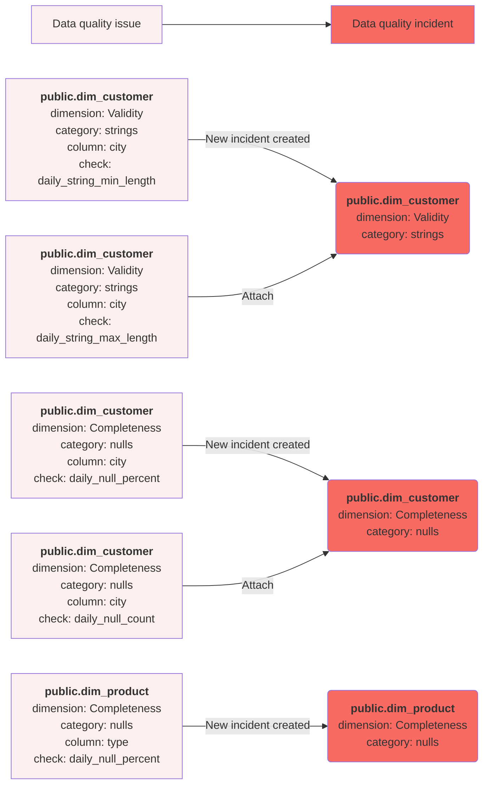

# Data quality incident management, grouping and notifications
This guide shows how DQOps correlates similar data quality issues into data quality incidents, and how the incident notification workflow works. 

## What is a data quality incident?

DQOps distinguishes **data quality issues** from **data quality incidents**. Because DQOps detects new data quality issues
by monitoring the data sources in regular intervals, the same issues will be detected until the root cause is not fixed.
Additionally, because DQOps supports hundreds of data quality checks, there are a lot of possible positive and false-positive
checks that can detect data quality issues.
Some data quality issues may be expected because data quality checks have not been disabled on a table that was decommissioned.
Other issues are caused by planned maintenance events. 

In order to avoid flooding the support team with a lot of data quality issues to resolve, DQOps implements
grouping of similar data quality issues into **data quality incidents**. The difference between a data quality issue
and data quality incident is described below.

 -  A **data quality issue** is a single data quality [check](definition-of-data-quality-checks/index.md) result that was not accepted by 
    a data quality [rule](definition-of-data-quality-rules.md), and was assigned a severity rule, which is one of *warning*, *error* or *fatal*.
    Data quality issues are stored in the [check_results](../reference/parquetfiles/check_results.md) parquet table.
    The data quality issues can be counted on the data quality dashboards for [counting issues](types-of-data-quality-dashboards.md#data-quality-issues-count).
    The percentage of data quality issues within the total number of data quality checks performed is also
    used to measure the overall quality of data by calculating the [data quality KPIs](definition-of-data-quality-kpis.md).
 
 -  A **data quality incident** is a group of similar data quality issues that share the same properties. 
    When the first data quality issue is identified that does not match any active incident, a new data quality incident is created
    and the issue is associated with it. DQOps stores the incidents in the [incidents](../reference/parquetfiles/incidents.md)
    parquet table.

    Data quality incidents are assigned to the support and engineering teams for assessment and resolution. 


## Incident workflow
The data quality incident management workflow is shown on the following diagram.

{ loading=lazy; width="1200px" }


The following statuses are used in the data quality incident workflow.

- **Open** for a new incident that was just detected because a new data quality issue (failed data quality check)
  was identified, and it did not match any other open, acknowledged or muted incident. These issues should be
  managed by the 2nd level support team or the data quality team. The issues must be first reviewed and assessed.
- **Acknowledged** is the next status that is assigned by the 2nd level support when the data quality issue is confirmed
  and is assigned to the 3rd level support team to be resolved.
- **Resolved** is the status assigned by the 3rd level support team when the issue is solved. The data quality team
  may subscribe to notifications when the acknowledged issues are assigned
- **Muted** is the status assigned to false-positive issues, issues that have low impact, or issues that cannot be solved,
  and it was conditionally accepted. DQOps will keep detecting data quality issues matching this incident.
  New incidents will be assigned to the muted incident for the next 60 days. The incident mute time window is configurable
  on a table level.


## Grouping issues into incidents
The **data quality incident** grouping level is configured on a connection level as shown on the *Incidents grouping* screen below.

{ loading=lazy; width="1200px" }

The following grouping levels are supported:

- Table
- Table and data quality dimension
- **Table, data quality dimension and check category**
- Table, data quality dimension, check category and check type
- Table, data quality dimension, check category and check name

You can also adjust the grouping level for **data quality incidents** at the table level in the **Incident configuration** tab.

By default, DQOps groups issues by the table where the issue was identified, the [data quality dimension](data-quality-dimensions.md),
and a data quality check category that mostly groups the check by the type of column or a way how the check is implemented.

It is also possible to raise data quality incidents only for **error** and **fatal** or only **fatal** severity issues.
The default configuration assigned to each data source will create a data quality incident for all data quality issues,
including **warning** severity issues. The warning severity issues include also many anomaly detection checks that are
sensitive and may raise unexpected issues that will engage the support team. An alternative method of managing **warning** severity
issues is to increase the *minimum severity level* for raising incidents to **error**, and use the
[current table status](types-of-data-quality-dashboards.md#current-table-status) dashboards to review warnings.

DQOps performs mapping of groups of data quality issues to an incident by calculating a hash code of all the selected
issue grouping components. The incident hash code is stored in the `incident_hash` column
in the [check_results](../reference/parquetfiles/check_results.md) parquet table. For every new data quality issue detected,
DQOps searches for an open data quality incident with the same incident hash code. When a matching incident is found
that is not yet in the **resolved** status, DQOps will increase the `last_seen` column value
in the [incidents](../reference/parquetfiles/incidents.md) table. All data quality issues that were detected
between the `first_seen` and the `last_seen` timestamps are considered as assigned to the same incident.

The following diagram shows how different data quality issues were grouped into three data quality incidents,
using grouping by table, data quality dimension, and a check category.




## Incident duration
If a data quality incident is open for more than *60* days since the first matching data quality issue was detected,
DQOps will create yet another incident and the new data quality issues will be associated with the new incident. 
This time window is configurable on the connection configuration screen shown above.
A different time window for matching new issues to incidents is configured for **Muted** incidents that were confirmed,
but the support team decided that they will not be resolved.


## Incident management

### **Overview**

DQOps allows you for a quick overview of all incidents within your environment.
To access the **Incidents summary**, click on the DQOps logo in the top left corner and select the **Incidents summary** tab.

{ loading=lazy; width="1200px" }

The DQOps user interface overview section provides [a more detailed description of the **Incident summary** screen](dqops-user-interface-overview.md#incidents_summary).

The list of incidents is shown in the *Incidents* section of the [DQOps user interface](dqops-user-interface-overview.md).
The incident review begins on the incident list screen shown below.

{ loading=lazy; width="1200px" }

The incidents are grouped by the data source. The user can search for incidents by all the fields shown on the incident list screen,
including the affected table name, the parent schema of the table, and the columns used for incident grouping: data quality dimension,
check category, check type or check name.

The incidents can be linked to 3rd party incident management systems, such as Jira, Azure DevOps or ServiceNow. 
Linking incidents is a manual operation, when the button in the *Issue Link* column is clicked, the url to the task in 
the 3rd party system should be added and saved. Incident linking can be also automated by calling 
the [set_incident_issue_url](../client/operations/incidents.md#set_incident_issue_url) operation from a Python
code or by calling the DQOps REST API directly.

When a single incident is clicked, DQOps shows the incident detail screen. The url to this screen can be copied
to the clipboard and send to another DQOps user, who can review the issue. Also, the link is shown
in the [Slack incident notifications](../integrations/slack/configuring-slack-notifications.md).

{ loading=lazy; width="1200px" }

The incident management screens are described in details on the 
[working with incidents and notifications](../working-with-dqo/managing-data-quality-incidents-with-dqops.md) page.

### **Disable check for the incident**

To manage incidents, you have the option to disable the check responsible for the incident. Disabling a check can be
useful when you are actively working to resolve the underlying issue.

To disable a check, click on the "Disable check" button in the top right corner of the Incident details screen.
Once confirmed, the check will be temporarily stopped from executing.

{ loading=lazy; width="1200px" }

You can verify that the check has been disabled by navigating to the check editor screen.

{ loading=lazy; width="1200px" }


### **Reconfigure check for the incident**

DQOps offers a one-click option to automatically reduce the number of data quality issues identified by a check.
This can be helpful in situations where the check might be overly sensitive.

Clicking the **Reconfigure** button will decrease the rule threshold for the data quality check that caused the incident by 30%. For more significant adjustments, you can click
the **Recalibrate** button multiple times. Each click will further reduce the check's thresholds by an additional 30%.

{ loading=lazy; width="1200px" }

The following example YAML files illustrate the `daily_partition_row_count` check configuration before and after reconfiguration. 
Notice that the `min_count` rule has been reduced from 1000, to 700.


=== "Check configuration before reconfiguration"

    ``` { .yaml .annotate linenums="1" hl_lines="17" }
    # yaml-language-server: $schema=https://cloud.dqops.com/dqo-yaml-schema/TableYaml-schema.json
    apiVersion: dqo/v1
    kind: table
    spec:
      timestamp_columns:
        event_timestamp_column: created_date
        ingestion_timestamp_column: close_date
        partition_by_column: created_date
      incremental_time_window:
        daily_partitioning_recent_days: 7
        monthly_partitioning_recent_months: 1
      partitioned_checks:
        daily:
          volume:
            daily_partition_row_count:
              error:
                min_count: 1000
    ```

=== "Check configuration after reconfiguration"

    ``` { .yaml .annotate linenums="1" hl_lines="17" }
    # yaml-language-server: $schema=https://cloud.dqops.com/dqo-yaml-schema/TableYaml-schema.json
    apiVersion: dqo/v1
    kind: table
    spec:
      timestamp_columns:
        event_timestamp_column: created_date
        ingestion_timestamp_column: close_date
        partition_by_column: created_date
      incremental_time_window:
        daily_partitioning_recent_days: 7
        monthly_partitioning_recent_months: 1
      partitioned_checks:
        daily:
          volume:
            daily_partition_row_count:
              error:
                min_count: 700
    ```


### **Configure notification for an incident**

To receive notifications for specific data quality incidents, you can create or edit notification filters.
To do this, click on the envelope icon located in the top right corner of the incident details screen.

{ loading=lazy; width="1200px" }

The action after clicking on the envelope icon will depend on whether the incident matches any existing incident.
[notification filters](grouping-data-quality-issues-to-incidents.md#notification-filters).

**Adding a new notification filter**.

If no notification has ever been configured for the incident, you will see a popup message informing you to create a new notification configuration.

{ loading=lazy; width="600px" }

Once approved, you will be redirected to the page to create the new incident notification filter. 
The configuration form will be partially filled based on the incident's data. The details of the filter configuration can be
found in the section [Notification filters](grouping-data-quality-issues-to-incidents.md#notification-filters) below.

{ loading=lazy; width="1200px" }

**Editing an existing notification filter**

If the notification matches an existing filter, a screen with this filter will open, and you can edit the filter's settings.


## Incident notifications

Incident notifications allow you to receive alerts via email or webhook whenever a new data quality incident occurs or its status changes.

There are two levels of notification configuration in DQOps:

1. **Global notifications:** This configuration applies to all incidents unless overridden. You can access it through the Configuration section > Global incident notifications.
2. **Connection notifications:** These configurations take precedence over global notifications and are specific to individual data sources.
    You can access them by navigating to a specific data source under the Data sources section > [Connection name] > Notifications tab.

**Default notification configuration**

The default notification is used as a backup when no filters match the incident. You can configure it within both global and connection notifications.

Initially, the default configuration is empty. Notifications will be sent to the specified addresses when they are set 
in the **Addresses for notifications of an incident state change** section.

If the incident **does not match** any filter and no address is set in the default notification, **no notification will be sent**.

### Configuring Global notifications

To access the **Global notifications** configuration:

1. Click on the **Configuration** section 
2. Select the **Global incident notifications** in the tree view on the left.

If no notifications filters are configured, only the default notification configuration will be present.
Here you can also create a new [notification filter](grouping-data-quality-issues-to-incidents.md#notification-filters) 
by clicking on the **Add notification filter** button in the top right corner.

{ loading=lazy; width="1200px" }

To configure the **default** notification, open the default notification configuration by clicking the **default** name or by clicking the **Edit** action button on the right. 

{ loading=lazy; width="1200px" }

Fill in the **email address** or **webhook URL** for the appropriate status fields.

You can also use multiple email addresses separated by the comma character (,). Mixing email addresses with webhook addresses is also allowed if you use commas between them.

The address field for the specific status can also be left as empty so no notifications will be received for that incident status.

### Configuring Connection notifications configuration
To access the **Connection notifications** configuration:

1. Click on the **Data sources** .
2. Select the connection of choice from the tree view on the left.
3. Click on the **Notification** tab in the right panel. 

If no notifications filters are configured, only the default notification configuration will be present.
Here you can also create a new [notification filter](grouping-data-quality-issues-to-incidents.md#notification-filters) by clicking on the **Add notification filter** button.

{ loading=lazy; width="1200px" }

To configure the **default** notification, open the default notification configuration by clicking the **default** name or the **Edit** action button on the right.
Fill in the **email address** and/or **webhook URL** to the appropriate status fields, as described above. 

### Notification filters

You have the option to further refine notifications by setting filters based on various criteria. Filters can be added to both Global and Connection notifications.

To add a new filter on the Global or Connection configuration:

1. Navigate to the Global or Connection configuration. 
2. Click the **Add notification filter button**.

    { loading=lazy; width="1200px" }

3. Set the name for the notification filter and specify the field that will be filtered.

   { loading=lazy; width="1200px" }

4. Fill in any field in the **Addresses for notifications of an incident state change** section with **email address** and/or **webhook URL**.
   

The filter configuration allows to specify the following:

| Field name                                  | Description                                                                                                                                                                                                                     |
|---------------------------------------------|---------------------------------------------------------------------------------------------------------------------------------------------------------------------------------------------------------------------------------|
| **Notification name**                       | The unique name of the filtered notification.                                                                                                                                                                                   |
| **Priority**                                | The priority of the notification. The notifications with a smaller number have higher priority and are matched first.                                                                                                           |
| **Notification message**                    | Additional message to be attached to the notification message. This can be the description of the notification, SLA note, etc.                                                                                                  |
| **Disabled**                                | Whether to send notifications for this filter.                                                                                                                                                                                  |
| **Process additional notification filters** | Specifies whether the next filters in priority order should be taken into account. When not set, the notification will be sent only to the addresses that match the first notification filter in the priority order.            |
| **Do not create incidents**                 | Specifies whether the notification message should be sent when the notification matches the filters. Setting this flag to true can break searching for the next matching notification without sending the notification message. |
| **Connection**                              | The target connection name filter. Supports search patterns in the format: 'source\*', '\*_prod', 'prefix\*suffix'.                                                                                                             |
| **Schema**                                  | The target schema name filter. Supports search patterns in the format: &#x27;schema_name_\*&#x27;, &#x27;\*_schema&#x27;, &#x27;prefix\*suffix&#x27;.                                                                           |
| **Table**                                   | The target table name filter. Supports search patterns in the format: &#x27;table_name_\*&#x27;, &#x27;\*table&#x27;, &#x27;prefix\*suffix&#x27;.                                                                               |
| **Data group name**                         | The target data group name filter. Supports search patterns in the format: 'group_name_\*', '\*group', 'prefix\*suffix'.                                                                                                        |
| **Check name**                              | The target check name filter. Uses the short check name which is the name of the deepest folder in the *checks* folder. This field supports search patterns such as: 'profiling_\*', '\*_count', 'profiling_\*_percent'.        |
| **Highest severity**                        | The target highest severity filter.                                                                                                                                                                                             |
| **Table priority**                          | The target table priority filter.                                                                                                                                                                                               |
| **Quality dimension**                       | The target quality dimension filter.                                                                                                                                                                                            |
| **Check category**                          | The target check category filter, for example: *nulls*, *volume*, *anomaly*.                                                                                                                                                    |*string*|                                                                                                                                                                                                           |
| **Check type**                              | The target check type filter. One of: profiling, monitoring, or partitioning.                                                                                                                                                   |

Setting a filter field (e.g. table) means that the incident's table name has to match the filter to receive the notification message.
When other filters are left empty, they are not taken into account and only non-empty filters are verified.

Filters such as connection, schema, table, data group name and check name support search patterns in format prefix\*, \*suffix, prefix\*suffix.

### Multiple notification filters

You can create multiple notification filters within a single configuration for specific scenarios. 

For example, a Data Engineering Team might receive notifications about Timeliness (data delay) or Validity (data ingestion issues) issues,
while a Data Asset Manager gets alerted about market completeness problems.

When using multiple filtered notification configuration, DQOps will send the notification based on the priority in **ascending order**,
unless the **Process additional notification filters** checkbox is selected.

Selecting **Process additional notification filters** checkbox will prevent the first matching filter from interrupting 
the search for the next configured filters. The system will continue to search for the next match. 
If this option is not selected, the first filter will interrupt the search process.

The notifications are sent using all the matched notification filters in this process. To stop the search process for 
the next matching filter without sending the notification message, select the **Do not create incidents** option. 
All preceding notifications that match the filters will be sent until the interrupting filter is matched.

### Email notifications

The notification received through email contains the following information about the incident.

| Field name              | Description                                                                                                                                                                        |
|-------------------------|------------------------------------------------------------------------------------------------------------------------------------------------------------------------------------|
| **Full table name**     | Schema and table name affected by a data quality incident. The name is linked to the incident in the application.                                                                  |
| **Data source**         | Connection name affected by a data quality incident.                                                                                                                               |
| **Last seen**           | The UTC timestamp when the data quality incident was last seen. Appears for all incident statuses except for open.                                                                 |
| **Quality dimension**   | The data quality dimension affected by a data quality incident.                                                                                                                    |
| **Check category**      | The data quality check category affected by a data quality incident.                                                                                                               |
| **Highest severity**    | The highest severity of the failed check detected in this data quality incident. Possible values include warning, error, and fatal.                                                |
| **Failed checks count** | The total number of failed data quality checks that were seen when the incident was raised for the first time.                                                                     |
| **Table priority**      | Shown when present. Table priority of the table that was affected by a data quality incident.                                                                                      |
| **Issue url**           | Shown when present. The link (URL) to a ticket in an external system that is tracking this incident.                                                                               |
| **Data group name**     | Shown when present. The data group name that was affected by a data quality incident.                                                                                              |
| **Check type**          | Shown when present. The check type that was affected by a data quality incident.                                                                                                   |
| **Check name**          | Shown when present. The check name that was affected by a data quality incident.                                                                                                   |
| **Message**             | Shown when present. The additional message of the notification message configured by the user from the filtered notifications. Default notification does not contain such a field. |


A sample notification received via email is shown below.

{ loading=lazy; width="600px" }


### SMTP Server configuration

Email notifications require configuring an SMTP server to send email messages.

The SMTP server can be configured by using **environment variables** or by setting **local settings in the user's home directory**.

The required environment variables are the following:

| Environment variable         | Description                  |
|------------------------------|------------------------------|
| **DQO_SMTP_SERVER_HOST**     | The SMTP Server host address |
| **DQO_SMTP_SERVER_PORT**     | The port for SMTP service    |
| **DQO_SMTP_SERVER_USESSL**   | Use SSL flag (true / false)  |
| **DQO_SMTP_SERVER_USERNAME** | User name                    |
| **DQO_SMTP_SERVER_PASSWORD** | Password                     |


The example of the SMTP Server configuration from the **.localsettings.dqopsettings.yaml** file

```yaml
spec:
  smtp_server_configuration:
    host: <host_address_here>
    port: <port_number_here>
    use_ssl: <true/false>
    username: <user_name_here>
    password: <password_here>
```

### Webhooks

DQOps supports the automation of incident workflows by utilizing notifications.
Review the description of how incidents can be integrated with other systems using [webhooks](../integrations/webhooks/index.md).

Incident notifications configured for [Slack](../integrations/slack/configuring-slack-notifications.md) 
use formatted messages that are displayed on the Slack channels as shown below.


## What's next

- Learn how to use the [incident management screens](../working-with-dqo/managing-data-quality-incidents-with-dqops.md)
  in the *Working with DQOps* section.
- Learn how to configure [data quality incident notifications with Slack](../integrations/slack/configuring-slack-notifications.md)
- Learn how a generic integration using [webhooks](../integrations/webhooks/index.md) is used for incident notifications.