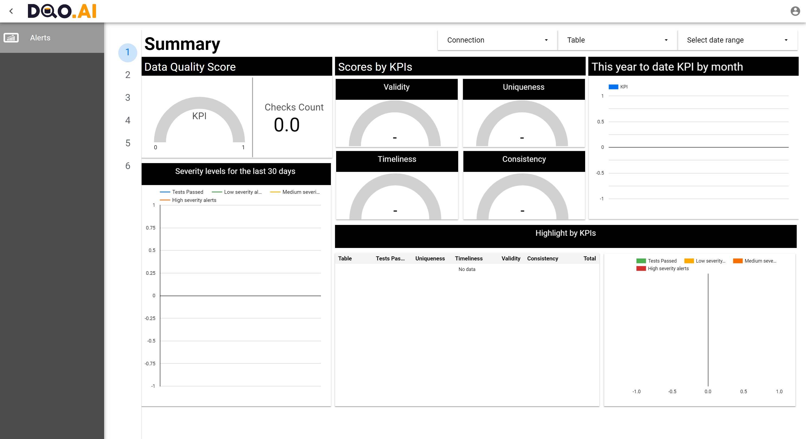
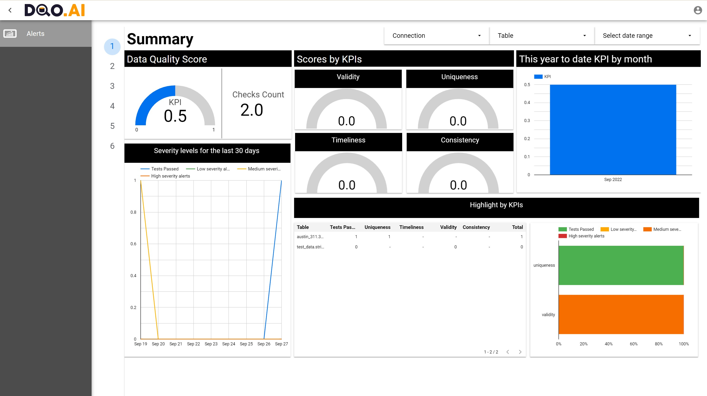

This section is about pushing the data to the cloud.

Cloud is a platform with dashboards with results of the checks.

An application programming interface (API) key is a unique code used to identify and authenticate an application or user. It is generated when first register. 
It is necessary to connect the results of checks made locally to the dashboards on the cloud.

Open a Command Prompt, run dqo and log in to the DQO Cloud by using the command `cloud login` or if there's a question about logging in to the Cloud type `Y`.

```
(dqoai) C:\>dqo
      _                               _
   __| |   __ _    ___         __ _  (_)
  / _` |  / _` |  / _ \       / _` | | |
 | (_| | | (_| | | (_) |  _  | (_| | | |
  \__,_|  \__, |  \___/  (_)  \__,_| |_|
             |_|

 :: DQO.AI Data Quality Observer ::    (v0.1.0)

Log in to DQO Cloud? [Y,n]: Y
Opening the DQO Cloud API Key request, please log in or create your DQO Cloud account.
DQO Cloud API Key request may be opened manually by navigating to: https://cloud.dqo.ai/requestapikey/7a22697373223a22323xxxxxxxxxxxxxxxxxxxxxxxxxxxxxxxx
Please wait up to 30 seconds after signup/login or press any key to cancel
API Key: 7a22746964223xxxxxxxxxxxxxxxxxxxxxxxxxxxxxxxxxxxxxxxxxxxx
DQO Cloud API Key was retrieved and stored in the settings.
```

This opens the DQO Cloud API Key request, please log in or create a DQO Cloud account.

Once logged in now it is possible to see the dashboard. Click on the `Alerts` at the top left side of the page.



As for now there is nothing in the dashboard as there haven't been any check. 
Please see [run data quality checks](../run_data_quality_checks/run_data_quality_checks.md) to understand how to run checks.

All sources(connections), sensors and rules are stored in the `userhome` catalogue.
All the results of checks are in the `userhome/.data/readings` catalogue and all the alerts are in the `userhome/.data/alerts`. This is what is sent to the cloud later.

Once a check is done, synchronize the cloud by using the command `cloud sync`. There are several options to this command:

- data - Synchronize local "data" folder with sensor readings and alerts with DQO Cloud
- sources - Synchronize local "sources" connection and table level quality definitions with DQO Cloud
- sensors - Synchronize local "sensors" folder with custom sensor definitions  with DQO Cloud
- rules - Synchronize local "rules" folder with custom rule definitions with DQO Cloud
- all - Synchronize local files with DQO Cloud (sources, table rules, custom  rules, custom sensors and data - sensor readings and alerts)

In this example we use the `all` option.

```
dqo.ai> check run
Check evaluation summary per table:
+------------+-------------------------------+------+--------------+-------------+------------+---------------+-------------+
|Connection  |Table                          |Checks|Sensor results|Valid results|Alerts (low)|Alerts (medium)|Alerts (high)|
+------------+-------------------------------+------+--------------+-------------+------------+---------------+-------------+
|connection_1|austin_311.311_service_requests|1     |1             |1            |0           |0              |0            |
+------------+-------------------------------+------+--------------+-------------+------------+---------------+-------------+
dqo.ai> cloud sync all
SOURCES local <-> cloud synchronization started
SOURCES local <-> cloud synchronization finished
SOURCES synchronization between local DQO User Home and DQO Cloud finished.

RULES local <-> cloud synchronization started
RULES local <-> cloud synchronization finished
RULES synchronization between local DQO User Home and DQO Cloud finished.

SENSORS local <-> cloud synchronization started
SENSORS local <-> cloud synchronization finished
SENSORS synchronization between local DQO User Home and DQO Cloud finished.

DATA_READINGS local <-> cloud synchronization started
DATA_READINGS local <-> cloud synchronization finished
DATA_READINGS synchronization between local DQO User Home and DQO Cloud finished.

DATA_ALERTS local <-> cloud synchronization started
DATA_ALERTS local <-> cloud synchronization finished
DATA_ALERTS synchronization between local DQO User Home and DQO Cloud finished.
```
This is how dashboard looks like now:




