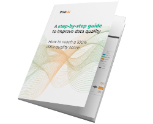

# What is DQOps?

DQOps is an DataOps friendly data quality monitoring tool with customizable data quality checks and data quality dashboards.
DQOps comes with more than 140 predefined data quality checks which helps you monitor the quality of your data.

## DQOps features
- Intuitive graphical interface and access via CLI
- Support of a number of different data sources: BigQuery, Snowflake, PostgreSQL, Redshift, SQL Server, and MySQL
- More than 140 built-in table and column checks with easy customization
- Table and column-level checks which allows writing your own SQL queries
- Daily and monthly date partition testing
- Data segmentation by up to 9 different data streams
- Built-in scheduling
- Calculation of data quality KPIs
- Built-in data quality dashboards
- Cloud hosted Data Quality Data Warehouse
- Incident management
- Incident notifications using webhooks

## Getting started

Try our [tutorial](./getting-started/index.md) to learn how to start monitoring your data with DQOps.

## Supported providers

You can use DQOps with the most popular databases. [Learn here how to connect a data source to DQOps](./working-with-dqo/adding-data-source-connection/index.md).

&nbsp; &nbsp; &nbsp; 
&nbsp; &nbsp; &nbsp; 
&nbsp; &nbsp; &nbsp; 
&nbsp; &nbsp; &nbsp; 
&nbsp; &nbsp; &nbsp; 
&nbsp; &nbsp; &nbsp; 

## DQOps user interface

DQOps has a dynamic user interface for configuration of all data quality checks that is similar to popular database management tools.
Tabs allow managing data quality checks at the same time on multiple tables. Just imagine that it is a web based
Visual Studio Code for data quality. 

 &nbsp; &nbsp; &nbsp; 

 &nbsp; &nbsp; &nbsp;  

## Additional resources

Want to learn more about data quality? 

Check out eBook ["A step-by-step guide to improve data quality"](https://dqops.com/dqo_ebook_a_step-by-step_guide_to_improve_data_quality-2/)
created by the DQOps team based on their experience in data cleansing and data quality monitoring.

