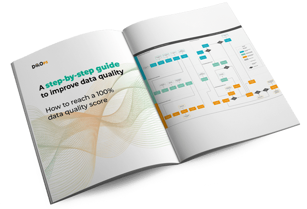

# DQOps overview

## What is DQOps Data Quality Operations Center?

!!! abstract "What is DQOps Data Quality Operations Center"

    <br/>
    <span class="center-content" style="font-size: 1.2rem;font-weight: 500">
    An open-source data quality platform for **data quality teams** and **data engineering teams**
    <br/>
    to make data quality visible to **business sponsors**
    </span>
    <br/>
    <br/>


!!! info ""

    <br/>
    <span style="font-size: 0.7rem;">
    Introducing data quality into the data governance process can be a challenging initiative. 
    Different teams and stakeholders have varying needs and goals. 
    The **data engineering** teams are more technical and prefer to measure data quality in code. 
    </span>

    <span style="font-size: 0.7rem;">
    The **data operations** team should be able to respond quickly to data quality issues and validate corrected data, but they are less technical and need a simple user interface.
    </span>

    <span style="font-size: 0.7rem;">
    Finally, business sponsors and the top management are not interested in the technical details. They only want to see a proof 
    that **data quality issues are handled** and the data quality score is **improving every month**. 
    </span>
    <br/>
    <br/>

## How DQOps addresses all data quality requirements?
<div class="grid cards grid-columns-150-pct" markdown>

-   :fontawesome-solid-people-group:{ .lg .middle } __Data Quality Operations Teams__

    ---

    If you plan to create a data quality operations team or designate an individual as a data quality specialist, you need a platform that can support them.
    The data quality operations team will configure data quality checks, review detected data quality incidents,
    and forward them to the data engineers or a data source platform owner.

    DQOps comes with a **built-in user interface** designed to manage the whole process in one place, allowing you to review multiple data quality issues and tables at the same time.

    [:octicons-arrow-right-24: Configure data quality checks in the user interface](dqo-concepts/dqops-user-interface-overview.md)

    [:octicons-arrow-right-24: Manage data quality incident workflows](dqo-concepts/grouping-data-quality-issues-to-incidents.md)

    [:octicons-arrow-right-24: Send notifications to data engineering teams using Slack](integrations/slack/configuring-slack-notifications.md)

-   :material-tools:{ .lg .middle } __Data Engineering Teams__

    ---

    The data engineers need a data quality platform that can integrate with the data pipeline code.
    When a severe data quality issue is detected in a source table, the data pipelines should be stopped and resumed when the problem is fixed.
    The data quality code should also be easy to version with Git, and modify the configuration without corrupting any file. 

    DQOps does not use a database to store the configuration. Instead, all data quality configuration files are stored in YAML files.
    The platform also provides a Python Client to **automate any operation** visible in the user interface.

    [:octicons-arrow-right-24: Configure data quality checks in code, with code completion](integrations/visual-studio-code/index.md)

    [:octicons-arrow-right-24: Run data quality checks from data pipelines using a Python client](client/index.md)

    [:octicons-arrow-right-24: Integrate DQOps with Apache Airflow](integrations/airflow/index.md) or [Dbt](integrations/dbt/index.md)

-   :material-desk:{ .lg .middle } __Business Sponsors__

    ---

    No data quality project can be started without the support of the top management and business sponsors. 
    You need to gain their trust that investing in data quality was worth it. Your business sponsors, external vendors that share data
    with you need to see a reliable data quality score that they understand and trust.
 
    DQOps measures data quality with **Data Quality KPIs**. Every user receives a complimentary Data Quality Data Warehouse hosted by DQOps,
    and can review the data quality status on data quality dashboards. DQOps even supports [custom data quality dashboards](integrations/looker-studio/creating-custom-data-quality-dashboards.md).

    [:octicons-arrow-right-24: Track the current data quality status with data quality dashboards](dqo-concepts/types-of-data-quality-dashboards.md)

    [:octicons-arrow-right-24: Measure data quality with KPIs](dqo-concepts/definition-of-data-quality-kpis.md)

    [:octicons-arrow-right-24: Manage iterative data quality improvement projects](dqo-concepts/definition-of-data-quality-kpis.md#improving-data-quality-with-kpis)

-   :material-layers-search:{ .lg .middle } __Data Science Teams__

    ---

    As a data scientist, you need a data quality platform where you can perform data profiling of new data before you use them as training datasets.
    The platform should be extensible because you may have many ideas about custom data quality checks, or even using machine learning to detect anomalies in data.
 
    DQOps has over 150+ built-in data quality checks, created as [templated Jinja2 SQL queries](dqo-concepts/definition-of-data-quality-sensors.md) and
    validated by [Python data quality rules](dqo-concepts/definition-of-data-quality-rules.md). You can **design custom data quality checks** that the data quality team will supervise,
    and the checks will be visible in the user interface.

    [:octicons-arrow-right-24: Profile the data quality of new datasets with 150+ data quality checks](dqo-concepts/definition-of-data-quality-checks/data-profiling-checks.md)

    [:octicons-arrow-right-24: Verify the data quality status of training data sets](client/index.md#get-table-data-quality-status)

    [:octicons-arrow-right-24: Define custom data quality checks and rules](dqo-concepts/definition-of-data-quality-rules.md)

</div>

## Supported data sources
[{ class=glightbox-ignored-image }](data-sources/athena.md)
&nbsp; &nbsp; &nbsp; [{ class=glightbox-ignored-image }](data-sources/bigquery.md)
&nbsp; &nbsp; &nbsp; [{ class=glightbox-ignored-image }](data-sources/databricks.md)
&nbsp; &nbsp; &nbsp; [{ class=glightbox-ignored-image }](data-sources/mysql.md)
&nbsp; &nbsp; &nbsp; [{ class=glightbox-ignored-image }](data-sources/oracle.md)
&nbsp; &nbsp; &nbsp; [{ class=glightbox-ignored-image }](data-sources/postgresql.md)
&nbsp; &nbsp; &nbsp; [{ class=glightbox-ignored-image }](data-sources/presto.md)
&nbsp; &nbsp; &nbsp; [{ class=glightbox-ignored-image }](data-sources/redshift.md)
&nbsp; &nbsp; &nbsp; [{ class=glightbox-ignored-image }](data-sources/single-store.md)
&nbsp; &nbsp; &nbsp; [{ class=glightbox-ignored-image }](data-sources/snowflake.md)
&nbsp; &nbsp; &nbsp; [{ class=glightbox-ignored-image }](data-sources/spark.md)
&nbsp; &nbsp; &nbsp; [{ class=glightbox-ignored-image }](data-sources/sql-server.md)
&nbsp; &nbsp; &nbsp; [{ class=glightbox-ignored-image }](data-sources/trino.md)

## Getting started
!!! info "Start with DQOps"

    <div class="grid cards" markdown>

    -   :material-book-open-page-variant:{ .lg .middle } __DQOps tutorial__
    
        ---
    
        Follow the DQOps tutorial to set up the platform, or simply see the whole data quality process with DQOps on examples.

        [:octicons-arrow-right-24: Getting started guide](getting-started/index.md)


    -   :material-image-broken-variant:{ .lg .middle } __Categories of data quality checks__
    
        ---
    
        Find out what types of most common data quality issues DQOps can detect. The manual for each category shows how to activate the check.
    
        [:octicons-arrow-right-24: Review the categories of data quality issues](categories-of-data-quality-checks/index.md)


    -   :material-download:{ .lg .middle } __Download from PyPI or Docker Hub__
    
        ---
    
        DQOps is **open-source** that you can start on your computer right now. Only the complimentary Data Quality Dashboards are hosted by DQOps. 
    
        [:octicons-arrow-right-24: Download from PyPI](dqops-installation/install-dqops-using-pip.md) or [Docker Hub](dqops-installation/run-dqops-as-docker-container.md)

    </div>


## Features

### Data quality checks
DQOps uses [data quality checks](dqo-concepts/definition-of-data-quality-checks/index.md) to capture metrics from data sources and detect data quality issues.

!!! success "Data profiling"

    <div class="grid" markdown>

    "){ loading=lazy }
    <div>

    **Profile data**

    DQOps has two methods of data profiling. The first step is capturing [basic data statistics](working-with-dqo/collecting-basic-data-statistics.md).
    
    When you know how the table is structured, you can experiment with [profiling data quality checks](dqo-concepts/definition-of-data-quality-checks/data-profiling-checks.md)
    and verify the [initial data quality KPI score](dqo-concepts/definition-of-data-quality-checks/data-profiling-checks.md#initial-data-quality-kpi-score) on 
    [data quality dashboards](dqo-concepts/types-of-data-quality-dashboards.md).

    [:octicons-arrow-right-24: Review data statistics](working-with-dqo/collecting-basic-data-statistics.md)

    [:octicons-arrow-right-24: Use data profiling checks](dqo-concepts/definition-of-data-quality-checks/data-profiling-checks.md)

    [:octicons-arrow-right-24: Review the initial data quality KPI score on dashboards](dqo-concepts/definition-of-data-quality-checks/data-profiling-checks.md#initial-data-quality-kpi-score)

    </div>
    </div>

!!! success "Data quality monitoring"

    <div class="grid" markdown>

    { loading=lazy }
    <div>

    **Run scheduled data quality checks**

    [DQOps user interface](dqo-concepts/dqops-user-interface-overview.md) is designed to resemble popular database management tools. The data sources, tables and columns are on the left.
    The workspace in the center shows tables and columns in tabs, which allows you to open multiple objects and edit many tables at once. 

    The [data quality check editor](dqo-concepts/dqops-user-interface-overview.md#check-editor) shows both the built-in data quality checks and custom data quality checks
    that you can define in DQOps.
    
    There are other methods to activate data quality checks. You can:

    [:octicons-arrow-right-24: Configure data quality checks in YAML](dqo-concepts/configuring-data-quality-checks-and-rules.md)

    [:octicons-arrow-right-24: Activate multiple checks at once](dqo-concepts/configuring-data-quality-checks-and-rules.md#activate-multiple-checks-at-once)
    
    [:octicons-arrow-right-24: Use DQOps shell](dqo-concepts/configuring-data-quality-checks-and-rules.md#activate-multiple-checks-with-the-dqops-shell)

    </div>
    </div>

!!! success "Anomaly detection"

    <div class="grid" markdown>

    { loading=lazy }
    <div>

    **Detect data anomalies**

    All historical metrics, such as a row count, minimum, maximum, and median value, are stored locally to allow time series prediction. 

    Detect outliers such as new minimum or maximum values. Compare metrics such as a sum of values between daily partitions.
    Detect anomalies between daily partitions, such as an unexpected increase in the number of rows in a partition.
    
    DQOps detects the following types of data anomalies:

    [:octicons-arrow-right-24: Detect anomalies in numeric values](categories-of-data-quality-checks/how-to-detect-anomaly-data-quality-issues.md#new-maximum)

    [:octicons-arrow-right-24: Compare seasonal data to a reference value](categories-of-data-quality-checks/how-to-detect-anomaly-data-quality-issues.md#compare-to-a-reference-point)

    </div>
    </div>


### Data quality dashboards
Over 50 built-in data quality dashboards let you drill-down to the problem.

!!! success "Data quality KPIs"

    <div class="grid" markdown>

    "){ loading=lazy }
    <div>

    **Review data quality KPI scores**

    DQOps measures data quality using a data quality KPI score. The formula is simple and trustworthy, the KPI is the percentage of **passed data quality checks**.

    DQOps presents the [data quality KPI scores](dqo-concepts/definition-of-data-quality-checks/data-observability-monitoring-checks.md#when-to-use-monitoring-checks)
    for each month, showing the **progress in data quality to business sponsors**.

    Data quality KPIs are also a great way to assess the [initial data quality KPI score](dqo-concepts/definition-of-data-quality-checks/data-profiling-checks.md#initial-data-quality-kpi-score)
    after profiling new data sources to identify areas for improvement.

    [:octicons-arrow-right-24: Data quality KPI score formula](dqo-concepts/definition-of-data-quality-kpis.md#data-quality-score-formula)

    [:octicons-arrow-right-24: Measure the initial data quality KPI score](dqo-concepts/definition-of-data-quality-checks/data-profiling-checks.md#initial-data-quality-kpi-score)

    [:octicons-arrow-right-24: Data quality KPI dashboards](dqo-concepts/types-of-data-quality-dashboards.md#data-quality-kpis)

    </div>
    </div>

!!! success "Data quality dashboards"

    <div class="grid" markdown>

    "){ loading=lazy }
    <div>

    **Track quality on data quality dashboards**

    DQOps provides a complimentary [Data Quality Data Warehouse](dqo-concepts/architecture/dqops-architecture.md#data-quality-data-warehouse)
    for every user. The data quality check results captured when monitoring data quality are first stored [locally on your computer in a Hive-compliant data lake](dqo-concepts/data-storage-of-data-quality-results.md).
    
    DQOps synchronizes the data to a complimentary [Data Quality Data Warehouse](dqo-concepts/architecture/dqops-architecture.md#data-quality-data-warehouse)
    that is accessed using a DQOps Looker Studio connector. You can even create [custom data quality dashboards](integrations/looker-studio/creating-custom-data-quality-dashboards.md).

    [:octicons-arrow-right-24: Types of data quality dashboards](dqo-concepts/types-of-data-quality-dashboards.md)

    [:octicons-arrow-right-24: Creating custom data quality dashboards](integrations/looker-studio/creating-custom-data-quality-dashboards.md)

    [:octicons-arrow-right-24: Data quality data lake table schema](dqo-concepts/data-storage-of-data-quality-results.md#parquet-tables)

    [:octicons-arrow-right-24: Using dashboards for daily data quality monitoring](working-with-dqo/daily-monitoring-of-data-quality.md)

    </div>
    </div>

### Data quality incidents
React to data quality incidents and assign them to the right teams who can fix the problem.

!!! success "Data quality incident management"

    <div class="grid" markdown>

    "){ loading=lazy }
    <div>

    **Data quality incident workflows**

    Organizations have separated operations team that react to data quality incidents first, and engineering teams
    that can fix the problems. The data engineering teams should not be engaged before the data quality issue is confirmed.

    DQOps reduces the effort of monitoring data quality by grouping similar data quality issues into **data quality incidents**.
    DQOps uses a [data quality incident workflow](dqo-concepts/grouping-data-quality-issues-to-incidents.md#incident-workflow) to
    create new incidents as `OPEN` when a new incident is detected. This allows the data quality operations team to review the problem
    and assign `ACKNOWLEDGED` incidents to data engineering.
    
    [:octicons-arrow-right-24: Data quality incident workflow](dqo-concepts/grouping-data-quality-issues-to-incidents.md)
        
    [:octicons-arrow-right-24: Sending notifications to slack](integrations/slack/configuring-slack-notifications.md)
    
    [:octicons-arrow-right-24: Sending notifications to any ticketing platform using webhooks](integrations/webhooks/index.md)

    </div>
    </div>

## DQOps is DevOps and DataOps friendly

Technical users can manage data quality check configuration at scale by changing YAML files in their editor of choice 
and version the configuration in Git. An example below shows how to configure the [`profile_nulls_count`](checks/column/nulls/nulls-count.md#profile-nulls-count)
data quality check in a DQOps YAML file that you can version in Git.

```yaml hl_lines="7-15"
# yaml-language-server: $schema=https://cloud.dqops.com/dqo-yaml-schema/TableYaml-schema.json
apiVersion: dqo/v1
kind: table
spec:
  columns:
    target_column_name:
      profiling_checks:
        nulls:
          profile_nulls_count:
            warning:
              max_count: 0
            error:
              max_count: 10
            fatal:
              max_count: 100
      labels:
      - This is the column that is analyzed for data quality issues
```

See how DQOps supports [editing data quality configuration files in Visual Studio Code](integrations/visual-studio-code/index.md),
validating the structure of files, suggesting data quality checks names and parameters, and even showing the help about 150+ data quality
checks inside Visual Studio Code.

You can also run data quality checks from data pipelines, and integrate data quality into [Apache Airflow](integrations/airflow/index.md)
using our [REST API Python client](client/index.md).

## Competitive advantages
<div class="grid cards grid-columns-150-pct" markdown>

-   :fontawesome-solid-bolt-lightning:{ .lg .middle } __Analyze very big tables__

    ---

    DQOps supports incremental data quality monitoring to detect issues only in new data.
    Additionally, DQOps merges multiple data quality queries into bigger queries to avoid pressure on the monitored data source. 
    
    [:octicons-arrow-right-24: Incremental data quality monitoring](dqo-concepts/incremental-data-quality-monitoring.md)

-   :material-dots-grid:{ .lg .middle } __Analyze partitioned data__

    ---

    DQOps can run data quality queries with a *GROUP BY date_column* to analyze partitioned data.
    You can get a data quality score for every partition.

    [:octicons-arrow-right-24: Analyze partitioned data](dqo-concepts/definition-of-data-quality-checks/partition-checks.md)

-   :material-compare-horizontal:{ .lg .middle } __Compare tables__

    ---

    Data reconciliation is a process of comparing tables to the source-of-truth. 
    DQOps compares tables across data sources, even if the tables are transformed.
    You can compare a large fact table to a summary table received from the finance department. 

    [:octicons-arrow-right-24: Compare tables between data sources](working-with-dqo/compare-tables-between-data-sources.md)

-   :material-format-list-group:{ .lg .middle } __Multiple data streams__

    ---

    What if your table contains aggregated data that was received from different suppliers, departments, vendors, or teams?
    Data quality issues are detected, but who provided you the corrupted data?
    DQOps answers the question by running data quality checks with grouping, supporting a hierarchy of up to 9 levels.

    [:octicons-arrow-right-24: Use GROUP BY to measure data quality for different data streams](dqo-concepts/measuring-data-quality-with-data-grouping.md)

</div>

## Additional resources
Want to learn more about data quality? 

!!! tip "Reaching 100% data quality KPI score"

    <div class="grid" markdown>

    [{ loading=lazy; class=glightbox-ignored-image }](https://dqops.com/dqo_ebook_a_step-by-step_guide_to_improve_data_quality-2/)
    <div>

    DQOps creators have written an eBook ["A step-by-step guide to improve data quality"](https://dqops.com/dqo_ebook_a_step-by-step_guide_to_improve_data_quality-2/)
    that describes their experience in data cleansing and data quality monitoring using DQOps. 

    The eBook desribes a full data quality improvement process that allows to reach a ~100% data quality KPI score within 6-12 months.
    [Download the eBook](https://dqops.com/dqo_ebook_a_step-by-step_guide_to_improve_data_quality-2/) to learn the process of managing
    an iterative data quality project that leads to fixing all data quality issues.
    
    { loading=lazy; width="150px" }

    _Click to zoom in_
    
    </div>
    </div>

