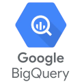
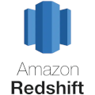
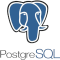
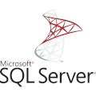

# What is DQO?

DQO is an DataOps friendly data quality monitoring tool with customizable data quality checks and data quality dashboards.
DQO comes with around 100 predefined data quality checks which helps you monitor the quality of your data.  

## DQO features
- Intuitive graphical interface and access via CLI
- Support of a number of different data sources: BigQuery, Snowflake, PostgreSQL, Redshift, SQL Server, and MySQL
- ~100 build-in table and column checks with easy customization 
- Table and column-level checks which allows writing your own SQL queries
- Daily and monthly date partition testing
- Data segmentation by up to 9 different data streams
- Build-in scheduling
- Calculation of data quality KPIs which can be displayed on multiple built-in data quality dashboards

## Getting started

Try our [tutorial](./getting-started/index.md) to learn how to start monitoring your data with DQO.

## Supported providers

You can use DQO with the most popular databases. [Learn here how to connect a data source to DQO](./working-with-dqo/adding-data-source-connection/index.md).

 &nbsp; &nbsp; &nbsp;  &nbsp; &nbsp; &nbsp;  &nbsp; &nbsp; &nbsp;  &nbsp; &nbsp; &nbsp; 

## Additional resources

Want to learn more about data quality? 

Check out eBook ["A step-by-step guide to improve data quality"](https://dqo.ai/dqo_ebook_a_step-by-step_guide_to_improve_data_quality-2/)
created by the DQO Team based on their experience in data cleansing and data quality monitoring.

