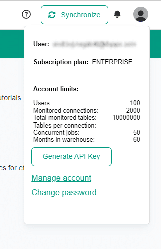
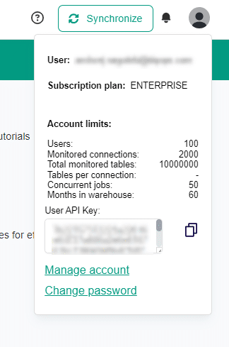

# How to activate data observability with Azure Data Factory
Read this guide to learn how to use DQOps API from Azure Data Factory to activate monitoring.

## Overview

You can easily utilize Azure Data Factory to call DQOps API for:

- running data quality checks,
- collect statistics about tables,
- import the table schema to DQOps,
- get table data quality status, 
 
and dozens of others.

for running data quality checks.
The guide will use the data stored in Azure Blob Storage.


## Prerequisite

Before you integrate DQOps into Azure Data Factory pipelines you need to configure a data source in DOQps.
You can easily connect to the data source located on [Azure](../../data-sources/azure.md), [Databricks](../../data-sources/databricks.md) or anywhere else. 
[DQOps supports all commonly used databases, check out the complete list here](../../data-sources/index.md).


## Azure Data Factory integration

Accessing the DQOps API involves using a personal API key to authenticate requests. 

### Getting the personal API Key

You can easily get your personal, user-unique API Key through the DQOps Web UI.

1. Open your DQOps instance's Web UI in your browser.
2. Click on your portrait in the top-right corner.
3. Click on the "Generate API Key" button.

{ loading=lazy } &nbsp;&nbsp;&nbsp;&nbsp; { loading=lazy }

You can copy the generated API Key and use it in Azure Data Factory.


### Run checks

Run checks job in DQOps executes checks depending on your selection. 
You can specify only those checks that are attached to the specific table on a connection, with specific names for label, quality dimension, type of checks and much more.

To create the run checks job in DQOps from Azure Data Factory create a new pipeline and put **Web** activity.

{ loading=lazy; }

Click on the Web activity and open the **Settings** tab.

Fill the **URL** with the link that calls run checks endpoint. It is crucial to set the wait parameter which makes the DQOps backend wait for finishing the execution. Calling the run checks endpoint without the wait parameter will run checks not allowing to see the results in Azure Data Factory. 

```
https://<your_DQOps_instance>/api/jobs/runchecks?wait=true
```

Replace **&lt;your_DQOps_instance&gt;** with your DQOps instance address.

Set **Method** as **POST**.

The **Body** of the request contains the filtering configuration that points to DQOps which checks should be run.

The below example runs all profiling checks that are enabled (turned on) on the table "files.readouts" from the "azure-storage-parquet" connection.
It also collects error samples on checks that fail.

```text
{
    "check_search_filters": {
        "connection": "azure-storage-parquet",
        "fullTableName": "files.readouts",
        "enabled": true, 
        "checkType": "profiling"
    },
    "collect_error_samples": true
}
```

The **Authentication combo box** leave as **None**. 

In **Headers** add three variables.

The names **accept** and **Content-Type** should contain value as **applicaiton/json**.

The name **Authorization** contain the token starting with **Bearer** and space character. The rest of the value is your personal API Key.

{ loading=lazy; }

Save the pipeline by clicking on **Publish all** button.

Now the pipeline can be executed. Navigate to **Add trigger** and select the **Trigger now**

{ loading=lazy; }

In a moment you should receive a notification about the execution completion of the pipeline. 

Click the **view pipeline run** link.

{ loading=lazy; }

Select the output of the Web activity.

{ loading=lazy; }

The DQOps API returned the JSON object.

{ loading=lazy; }

```json5 hl_lines="6-14"
{
	"jobId": {
		"jobId": 1720691395000000,
		"createdAt": "2024-07-11T09:49:55.017423827Z"
	},
	"result": {
		"highest_severity": "warning",
		"executed_checks": 143,
		"valid_results": 143,
		"warnings": 47,
		"errors": 0,
		"fatals": 0,
		"execution_errors": 0
	},
	"status": "finished",
    // ...
}
```

You can see running checks resulted with 47 execution warnings. The data has a quality issue and needs to be reviewed.

The execution of the run checks API call can be incorporated into existing pipelines to make branches during pipeline execution.

### Integrate run checks action with your pipeline

You can integrate run checks that can disallow to copy new data to the corrupted data source.

To achieve this you need to base on the returned JSON from DQOps.

The example first calls the DQOps to fetch the status of your data. Then the status is verified. 
If it succeeded the data was copied. Otherwise, the pipeline is marked as failed, returning the code of the issue.

{ loading=lazy; }

To create this pipeline add the **If condition** activity to the previously configured Web activity (now named as "DQOps run checks") 
and fill the **Expression** field with:

```text
@contains(activity('DQOps run checks').output.result.highest_severity, 'valid')
```

The expression verifies that the highest severity from the returned JSON is "valid".

The valid status means that no issues have been detected. If any will, the status becomes the severity of the issue.
You can see there one of the following: warning, error, fatal.

For marking the issue, add the **Fail** activity in the False section of the If condition activity.

For making Fail activity more informative, the returned data from DQOps API can be used.

Fill **Fail message** (simply as e.g. "Data quality issue detected") and **Error code** (the code below).

```text
@if(
    contains(activity('DQOps run checks').output.result.highest_severity, 'warning'), 1,
    if(
        contains(activity('DQOps run checks').output.result.highest_severity, 'error'), 2,
        if(
            contains(activity('DQOps run checks').output.result.highest_severity, 'fatal'), 3, 4
        )
    )
)
```

The Error code transcodes the severities to the integer numbers marking severities as follows: warning - 1, error - 2, fatal - 3.
The code 4 stands for other issues such as sensor execution errors or user misconfigurations in DQOps.

{ loading=lazy; }

If no issues are present, the copy data activity is executed. 

Otherwise, you will see the failure on the Monitor page with the error message.

{ loading=lazy; }

The details of the error provides you with the error code as well.

{ loading=lazy; }
{ loading=lazy; }

Instead of Fail activity you can also run another REST API that will inform about data quality issues as fast as is detected.

### Example jobs

DQOps REST API provides an extensive range of endpoints. You can reach the details through the Swagger API.

```url
https://**<your_DQOps_instance>**/swagger-ui/#/
```

Replace **&lt;your_DQOps_instance&gt;** with your DQOps instance address.


=== "Collect statistics"

    Collect statistics job in DQOps provides summary information about your tables and columns.
    This information is valuable in deciding which data quality checks and threshold levels should be set to monitor data quality.
    You can specify to run this job only to the specific table on a connection.

    ```url
    https://<your_DQOps_instance>/api/jobs/collectstatistics/table?wait=true
    ```

    The **Body** of the request contains the name of the table on which statistics will be collected.
    
    The below example collects statistics for the table "files.readouts" from the "azure-storage-parquet" connection.
    
    ```json5
    {
        "connection": "azure-storage-parquet",
        "fullTableName": "files.readouts",
        "enabled": true
    }
    ```

    Example of the returned response.

    ```json5
    {
        "jobId": {
            "jobId": 1720701935000000,
            "createdAt": "2024-07-11T12:45:35.687507400Z"
        },
        "result": {
            "executed_statistics_collectors": 43,
            "columns_analyzed": 3,
            "columns_successfully_analyzed": 3,
            "total_collectors_failed": 0,
            "total_collected_results": 140
        },
        "status": "finished",
        // ...
    }
    ```

=== "Import table"

    The import table job is used to import the table schema to the existing connection in DQOps.

    ```url
    https://<your_DQOps_instance>/api/jobs/importtables/table?wait=true
    ```

    The **Body** of the request of the below example imports table schema of "files.readouts" table from the "azure-storage-parquet" connection.
    
    ```json5
    {
        "connectionName": "azure-storage-parquet",
        "schemaName": "files",
        "tableNames": [
            "readouts"
        ]
    }
    ```

    Example of the returned response.

    ```json5
    {
      "jobId": {
        "jobId": 1720701935000000,
        "createdAt": "2024-07-11T12:45:35.687507400Z"
      }, 
      "result": {
        "source_table_specs": [{
          "incremental_time_window": {
            "daily_partitioning_recent_days": 7, 
            "monthly_partitioning_recent_months": 1
          }, 
          "columns": {
            "actual_value": {
              "type_snapshot": {
                "column_type": "DOUBLE", 
                "nullable": "True"
              }, 
              "comments": []
            }, 
            "check_category": {
              "type_snapshot": {
                "column_type": "VARCHAR", 
                "nullable": "True"
              }, 
              "comments": []
            }, 
            // ...
          }, "comments": []
        }]
      }, 
      "status": "finished"
    }
    ```


=== "Get table data quality status"

    The table data quality status receives the overall data quality status of a table based on checks run in the DQOps platform.
    If there are any issues with the table, the operator will inform about the scale of the issue and point towards a specific area of the data quality that needs improvement.
    
    It can be used to collect information about the data quality before or after the execution of a significant operation, which might save operational costs and time.

    The URL contains the name of the connection, schema and table.

    Request method: GET

    ```url
    http://<your_DQOps_instance>/api/connections/{connectionName}/schemas/{schemaName}/tables/{tableName}/status
    ```

    The below url calls api to receive status for the table files.readouts from the azure-storage-parquet connection.

    ```url
    http://<your_DQOps_instance>/api/connections/azure-storage-parquet/schemas/files/tables/readouts/status
    ```

    Example of the returned response.

    ```json5
    {
        "connection_name": "azure-storage-parquet",
        "schema_name": "files",
        "table_name": "readouts",
        "current_severity": "valid",
        "highest_historical_severity": "valid",
        "last_check_executed_at": "2024-07-10T12:33:11.818Z",
        "executed_checks": 406,
        "valid_results": 399,
        "warnings": 5,
        "errors": 2,
        "fatals": 0,
        "execution_errors": 0,
        "data_quality_kpi": 100,
        "checks": {
            // ...
        },
        "columns": {
            // ...
        },
        "dimensions": {
            // ...
        }
    }
    ```

## Next steps

- We have provided a variety of use cases that use openly available datasets from [Google Cloud](https://cloud.google.com/datasets) to help you in using DQOps effectively. You can find the [full list of use cases here](../../examples/index.md).
- DQOps allows you to keep track of the issues that arise during data quality monitoring and send alert notifications directly to Slack. Learn more about [incidents](../../working-with-dqo/managing-data-quality-incidents-with-dqops.md) and [notifications](../../integrations/webhooks/index.md).
- The data in the table often comes from different data sources and vendors or is loaded by different data pipelines. Learn how [data grouping in DQOps](../../working-with-dqo/set-up-data-grouping-for-data-quality-checks.md) can help you calculate separate data quality KPI scores for different groups of rows.
