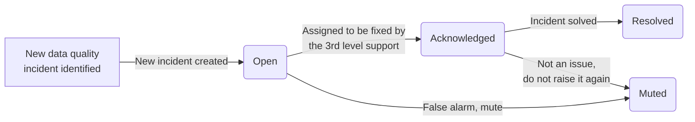

# Incidents overview

With the help of DQOps, you can conveniently keep track of the issues that arise during data quality monitoring. The Incidents section aggregates
these issues into incident and allows you to view and filter them, as well as manage their status.

Issues can be grouped into incidents based on the following categories:

- Table
- Table and quality dimension
- Table, quality dimension and check category
- Table, quality dimension, check category and check type
- Table, quality dimension, check category and check name

## Incident workflow
The data quality incident management workflow is shown on the following diagram.

The following statuses are used for data quality incidents.

- **Open** for a new incident that was just detected because a new data quality issue (failed data quality check)
  was identified and it did not match any other open, acknowledged or muted incident. These issues should be
  managed by the 2nd level support team or the data quality team. The issues must be first reviewed and assessed.
- **Acknowledged** is the next status that is assigned by the 2nd level support when the data quality issue is confirmed
  and is assigned to the 3rd level support team to be resolved. 
- **Resolved** is the status assigned by the 3rd level support team when the issue is solved. The data quality team
  may subscribe to notifications when the acknowledged issues are assigned
- **Muted** is the status assigned to false-positive issues, issues that have low impact, or issues that cannot be solved,
  and it was conditionally accepted. DQOps will keep detecting data quality issues matching this incident.
  New incidents will be assigned to the muted incident for the next 60 days. The incident mute time window is configurable
  on a table level.
  

## Configure incidents

Incidents are the default function of DQOps and automatically groups issues.

To modify the settings of the Incidents, follow these steps:

1. Go to the **Data Sources** section.

2. Select the relevant data source.

3. Select the **Incidents And Notifications** tab.

   

4. Update the settings and click the **Save** button

On the Incidents and Notifications tab, you can customize:

- The level of grouping for data quality incidents.

- The minimum severity level required for generating an incident.

- Whether incidents should be created for the entire data source or for each group of rows separately,
  using [data grouping](../set-up-data-grouping/set-up-data-grouping.md).

- The maximum duration of an incident in days. After this time, DQOps creates a new incident.

- The time duration for muted incidents. If the incident is muted, DQOps will not create a new one.

## View and manage Incidents

To access a summary of incidents that occur during data quality monitoring, navigate to the **Incidents** section.

On the left side of this screen, there is a list displaying the connections and the number of incidents that have
occurred for each one. On the right panel, you can view incidents for the connections you have selected, and you can
filter, sort, and view detailed information about the incidents.

For each incident the following information is provided:

- **Resolution status**: A status assigned to the incident (Open, Acknowledged, Resolved or Muted)
- **Failed check count**: The number of times the check has occurred in the selected time range
- **Schema**: Name of the schema in which data quality issues were detected
- **Table**: Name of the table in which data quality issues were detected
- **Checks**: Name of the failed data quality check or a group of checks. Click this link to view details of the incident.
- **First seen**: The time at which this issue first appeared.
- **Last seen**: The time at which this issue last occurred.
- **Issue link**: A link to the issue tracker

By default, incidents are grouped by table name. To change the grouping method click the **Configure** button in the upper right which
will link you to the **Incidents and Notifications** tab in the **Data Source** section.
Change the level of grouping for data quality incidents and click the **Save** button.

## Filter incidents

Use filtering to restrict the types of issue groups that appear in the list.

You can filter the list of incidents **by the resolution status** by selecting or deselecting status type in the resolution status filter.

You can filter the list of incidents **by the keyword**, such as schema, table or check name, by typing it in the input box.

You can restrict the incidents that appear in the list to a **specific time range**: current month, last 2 months, or last 3
months using the time range filter buttons.

## Sort incidents

You can sort the incidents table. Simply click on the sorting icon next to any column header to sort the incidents table by that column.

## Change the resolution status

To help you manage the incidents, each of them can have the following resolution status values:

- **Open**: The default initial state of all incidents. The other states are set manually. You can revert an incident's status back to Open at any time.
- **Acknowledged**: A state indicating that the incident was acknowledged.
- **Resolved**: A state indicating that an incident is fixed.
- **Muted**: A state for hiding the incident from your list. By default, any data quality issues associated with that
  incident will be muted for 60 days. If an incident is muted, DQOps will not create a new one. To change the time duration for muted incidents
  click the **Configure** button.

To change the resolution status, simply chose the status from the dropdown menu.

## Add Issue link

You can add an **issue tracker link** to an incident by clicking the "+" button in the **Issue Link** column.

## View details of the incident

To view detailed data quality issues of the incident, click the link in the **Checks** column.

The detailed data quality incident screen shows a list of data quality issues which are grouped in the incident and allows you to
filter and sort them.

## Filter data quality checks

Use filtering to restrict the types of data quality issues that appear in the list and on the bar chart.

You can filter the list of issues **by the keyword** by typing it in the input box.

You can use time range filter buttons to show only the data quality issues from the last day, 7 days, 30 days, or view all issues.

You can filter the list of issues **by column** or **check name** by clicking on the name of the column or the check name in the appropriate boxes.

## Sort incidents

To sort the issue table, simply click on the sorting icon next to any column header.

## What's next

- [Learn more about incident notifications](../../integrations/webhooks/index.md)